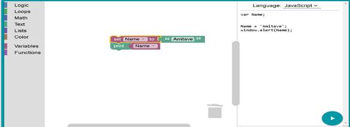
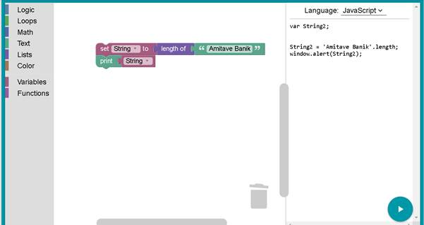
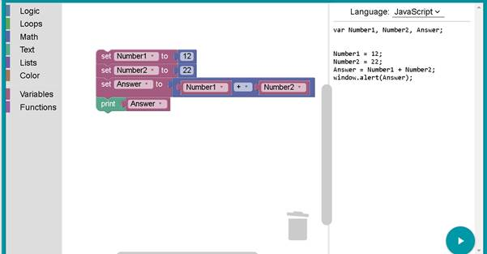
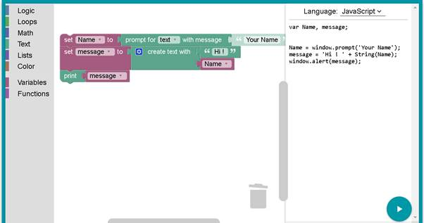
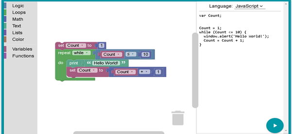
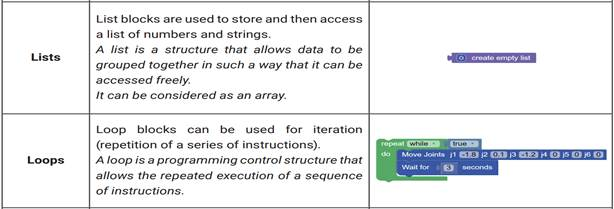
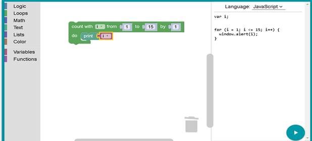
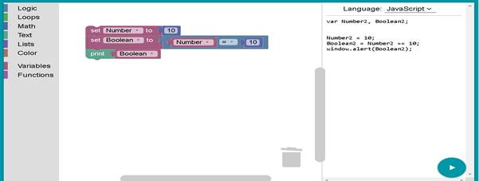
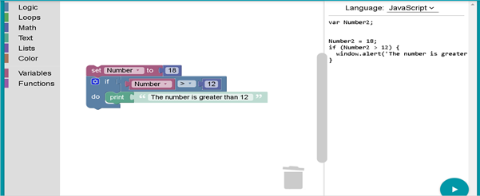
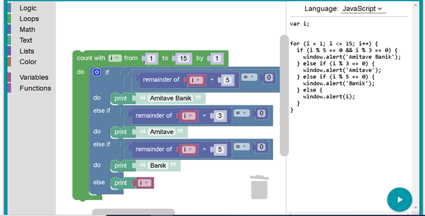

# Computational Thinking Lab 06 -- Google’s Blockly

## What is Variable?

Variable is an important programming concept. In essence, Variable as containers that hold information. Variable are used to store information to be referenced and manipulated in a computer program. For example, assume you want to store value in your program and at a later stage, you want to use this value. You can assign a value to a variable using equal to (=) operator when you declare. Let us see how you will do it. Here are the following three simple steps – 

- Create variable with appropriate name.
- Store your value in this variable.
- Retrieve and use the stored value from the variable.

Blockly supports dynamically typed languages such as Python and JavaScript and with a little extra work, you can add information to support strongly typed languages (or static typed languages) such as Java or C.

## Assign and display a variable in Google’s Blockly

- Create a variable and change its name to name.
- Use a text block to assign its value to the name that you want.
- Use the print block to display the value of name in a pop-up.

### Creation of a basic Blockly task

    

This graphical representation shows that you can use variables and text tools to declare variables and assign visually and print your name. Right side you can see the JavaScript shows that how did you declare variable. Basically, the left side is where you can configure the tool, and the right side will display a live preview of what you did so far. The left side has two tabs: the toolbox will hold the pool of blocks that the student can use to solve the task. To add blocks, simply click on one category and drag/drop the block you want in the tab.

Now you may go to the link - [**https://developers.google.com/blockly/**](https://developers.google.com/blockly/) and try to declare variable and attempt to display / print your name. 

- Now your tasks – Declare an integer variable and assign the variable. Then print the integer variable. 

## Find out the length of a string

    

- Now your tasks - Find out the length of your name  

## Arithmetic Operators

The basic arithmetic operations are addition, subtraction, multiplication, and division. Arithmetic is performed according to an order of operations. An operator performs an action on one or more operands. The common arithmetic operators are:   

| **Action**                         | **Common Symbol** |
| ---------------------------------- | ----------------- |
| Addition                           | +                 |
| Subtraction                        | -                 |
| Multiplication                     | *                 |
| Division                           | /                 |
| Modulus (associated with integers) | %                 |

These arithmetic operators are binary that is they have two operands. The operands may be either constants or variables like age + 1

### Arithmetic Assignment Operators

Many programming languages support a combination of the assignment (=) and arithmetic operators (+, -, *, /, %). Various textbooks call them “compound assignment operators” or “combined assignment operators”. Their usage can be explained in terms of the assignment operator and the arithmetic operators. In the table, we will use the variable age and you can assume that it is of integer data type.

| **Arithmetic assignment examples:** | **Equivalent code:** |
| ----------------------------------- | -------------------- |
| age += 14                           | age = age + 14       |
| age -= 14                           | age = age - 14       |
| age *= 14                           | age = age * 14       |
| age /= 14                           | age = age / 14       |
| age %= 14                           | age = age % 14       |

The below program will calculate Addition (+) and assign the value to answer variable. Finally, it will print the value of answer. 

    

- Now your tasks - Declare any two numbers: 20,10 or any numbers you like the best and perform all arithmetic operations 

## User Input

Instead of setting the value of name in code, let us ask the user for their name. Replace the ‘hard-coded’ text block with a prompt block that gets input from the user. You can optionally add a message to display in the prompt, such as “Your name please?”.

    

If you want to delete a block, simply drag it to the trashcan on the bottom right.

If you want to do these tasks you need to know the - **THE PROGRAMMING BLOCKS** below -  

- Now your tasks –- declare two variables and ask user to enter name and display name along with any message. 

More variable declaration below – 

- Now your tasks - Build and analysis the visual development representations and explain how it works!

A “For” Loop is used to repeat a specific block of code a known number of times. 

     

Step 1: First initialization happens, and the counter variable gets initialized.

Step 2: In the second step the condition is checked, where the counter variable is tested for the given condition, if the condition returns true then the statements inside the body of for loop gets executed, if the condition returns false then the for loop gets terminated and the control comes out of the loop.

Step 3: After successful execution of statements inside the body of loop, the counter variable is incremented till 15 times. 

- Now your tasks – In while loop control statement, loop is executed until condition becomes false. Using while loop control statement, write a programme OUTPUT will be: 3 4 5 6 7 8 9

## Boolean Expression

In computer science, a Boolean expression is an expression used in programming languages that produces a Boolean value when evaluated. A Boolean value is either true or false. For interpretation, zero is interpreted as false and anything non-zero is interpreted as true. Below program displayed True based on the condition

​       ****  

****

- Now your tasks - set up the condition and display Boolean value true / false using Relational Operators such as Greater than (>), Less than (<), Greater than or equal to (>=), Less than or equal to (<=), and Not equal to (!=) 

## Conditional Statements

   ****  

- Now your tasks – Set the condition (number) less than 12 and find out the result 

## else..if statement

The else..if statement is useful when you need to check multiple conditions within the program, nesting of if - else blocks can be avoided using else..if statement.

    

- How may this programme work?

Given a list of numbers like 15 and divided by 3 thus will display Amitave else divided by 5 then display Banik. If divided by 3 and 5 finally display Amitave Banik. You need to create this programme by yourself 

- Do by yourself - 

In this program user is asked to enter the age and based on the input, the if..else statement checks whether the entered age is greater than or equal to 18. If this condition meets then display message “You are eligible for voting”, however if the condition doesn’t meet then display a different message “You are not eligible for voting”. 

Example of output may be: Enter your age:14

You are not eligible for voting 