# Computer Systems Lab 4 - State Machines

In this lab, we will use JFLAP to model state machines. JFLAP will be available on the desktop of the Azure Labs Windows desktop. You can also download and install JFLAP for your own machine, although you will first need to install Java.

JFLAP comes as a JAR (Java ARchive) file. Once Java is installed you should be able to double click on the JFLAP JAR file to start the application.

## JFLAP Interface

When you start JFLAP you will be presented with the following window:

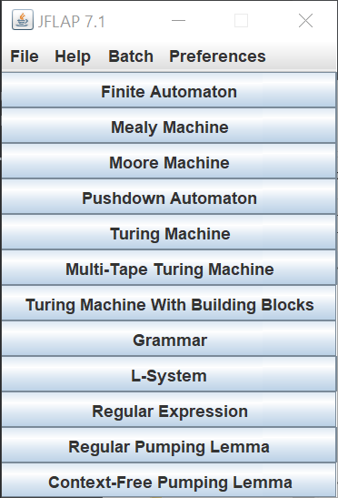

**Select Finite Automaton to open the state machine design interface**. 

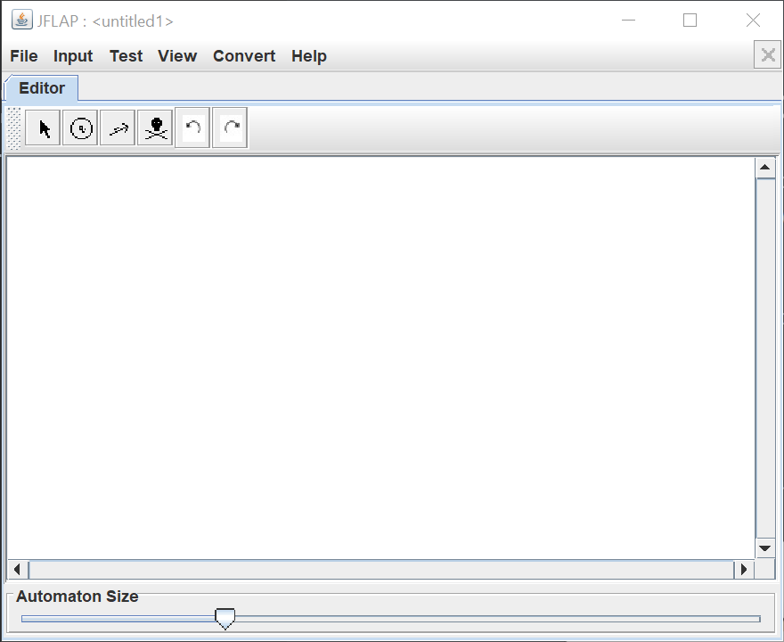

The toolbar has six buttons. From left-to-right:

- Attribute editor.
- State creator.
- Transition creator.
- Delete.
- Undo.
- Redo.

## Creating a State Machine

Let us create a simple state machine.

### Creating States

1. **Select the state creator tool in the toolbar.**
2. **Click on the canvas in the location you want to create the state.**
3. **Create a second state to the right of the first state.**

Your diagram should be similar to the following:

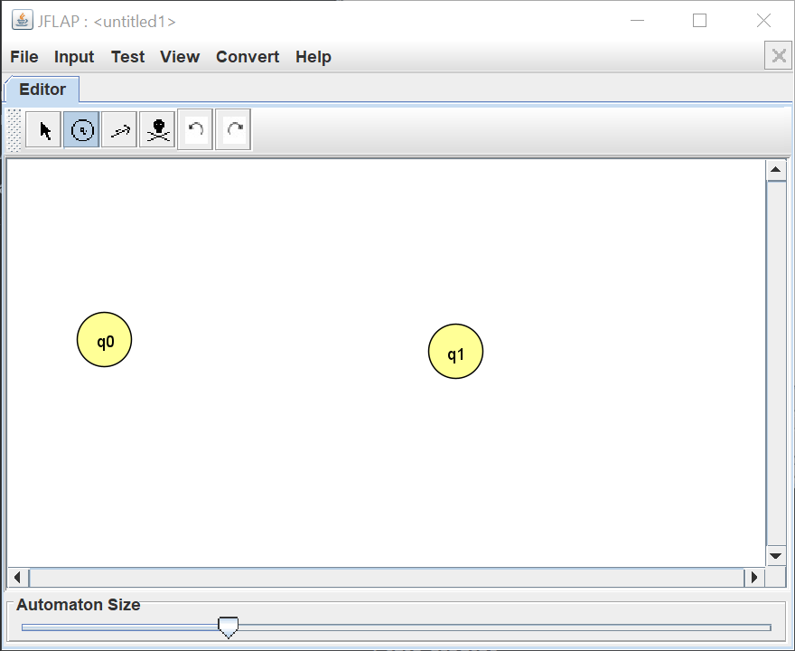

### Defining the Initial and Final States

1. **Select the attribute editor tool from the toolbar.**
2. **Right-click on the state $q0$ and in the pop-up menu displayed select Initial.**
3. **Right-click on the state $q1$ and in the pop-up menu displayed select Final.**

Your diagram should now look as follows:

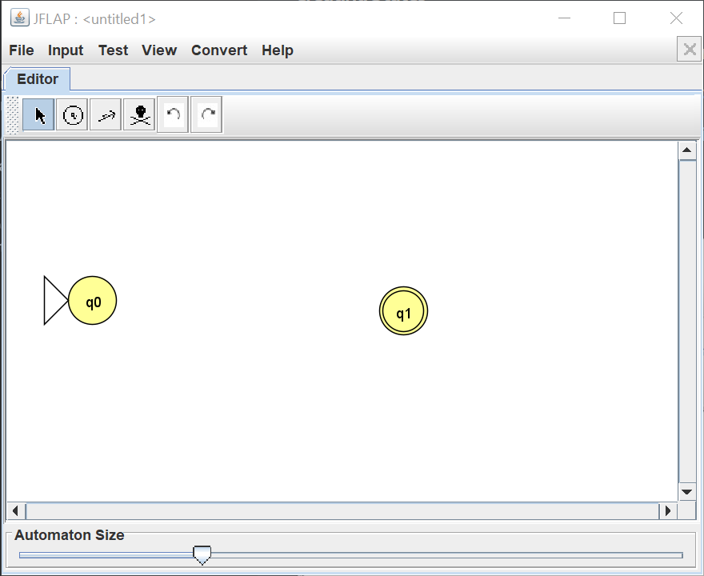

### Creating Transitions

1. **Select the transition creator tool from the toolbar.**
2. **Click on $q0$ and drag to $q1$. In the text box type 1. We’ve now created the transition of $q0$ to $q1$ as 1.**
3. **Repeat the state transition creation process and create the following transitions:**
   - **$q1$ to $q0$ is 0.**
   - **$q0$ to $q0$ is 0.**
   - **$q1$ to $q1$ is 1.**

Your diagram should look as follows:

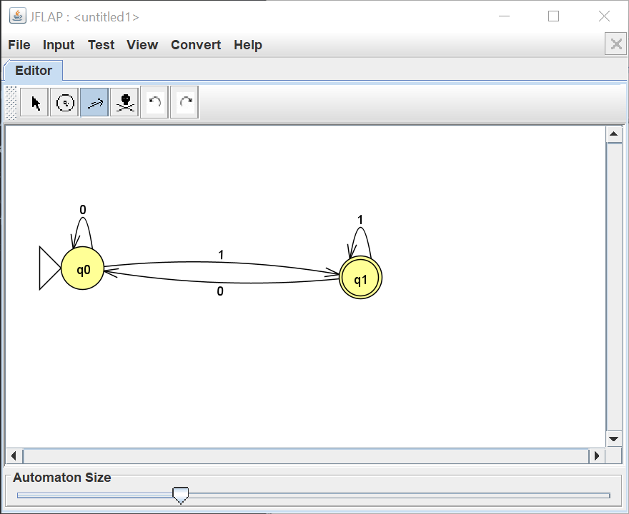

## Running the Finite Automaton

Now we have completed the finite automaton we can test it to see what strings it will accept. **From the menu select, Input then Multiple Run.** You will be presented with the following:

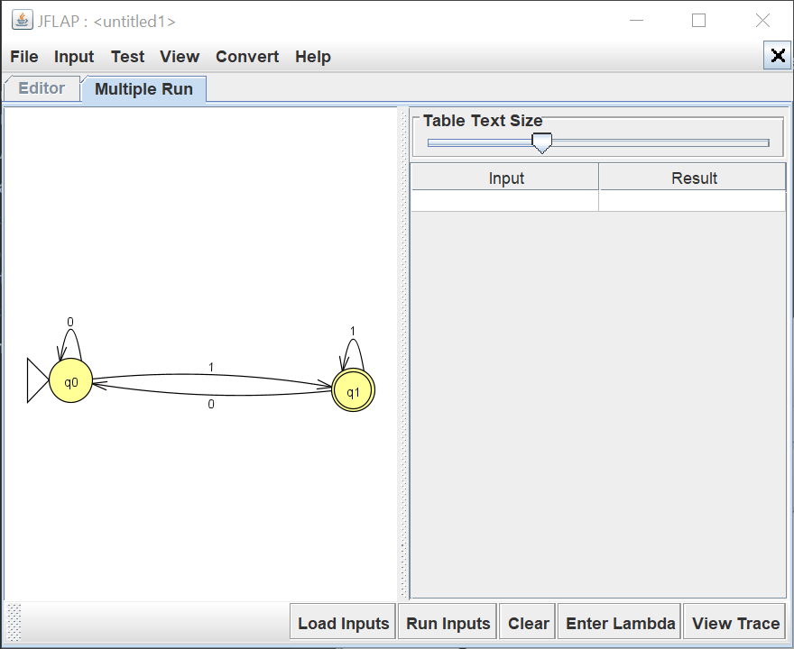

We can now test strings of 0s and 1s to see if the state machine will accept them. Enter the following strings:

- 11011
- 1100
- 10
- 11
- 0011

**Click Run Inputs to test the strings. You should have the following results:**

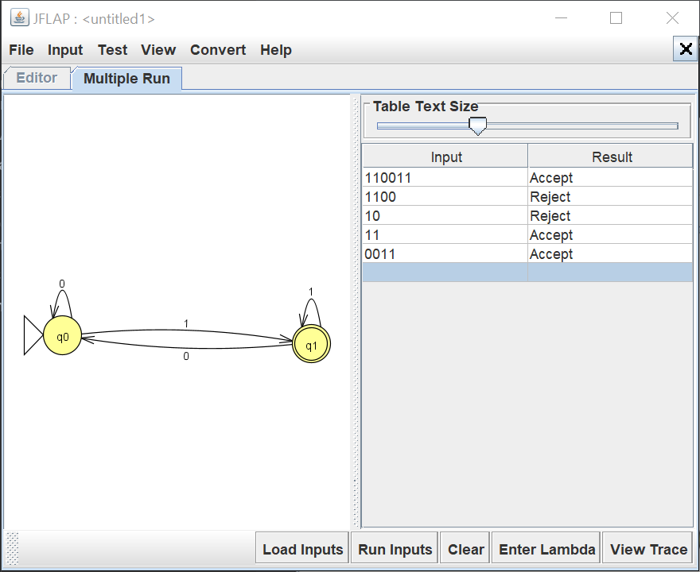

### Exercise

Can you define the general rule for this state machine? That is, can you state clearly what binary strings the machine will accept and which it will not accept?

## Larger State Machine

Now create a new state machine with the following state transitions:

- $q0 \to q1$ is 0 and 1.
- $q1 \to q2$ is 0 and 1.
- $q2 \to q3$ is 0.
- $q2 \to q4$ is 1.
- $q3 \to q5$ is 0 and 1.
- $q4 \to q4$ is 0 and 1.
- $q5 \to q5$ is 0 and 1.

Set $q0$ as the initial state and $q3$ and $q5$ as final states. Your diagram should be the same as follows:

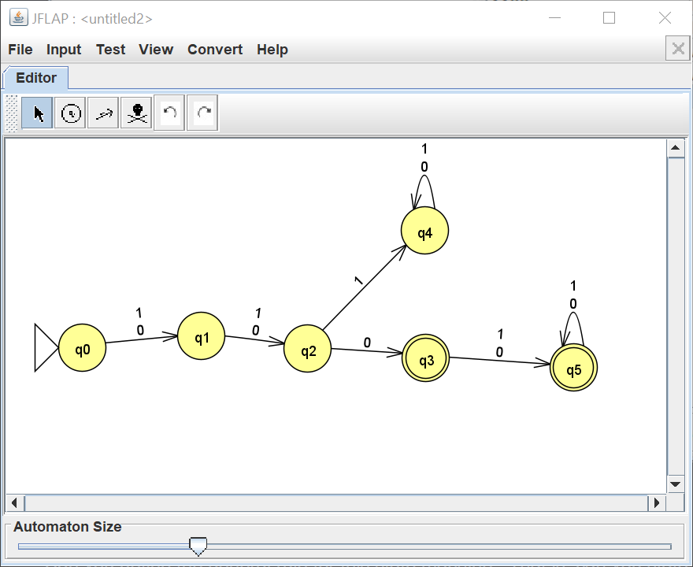

**First, try to determine which strings this finite automaton will accept.** With this knowledge, determine if the following strings will be accepts:

1. 1101
2. 0100
3. 0011
4. 1011

Test these strings in JFLAP to confirm your understanding.

## Pattern Matching

Let us now create a state machine that will accept any string that has the pattern 0011 within it. The pattern could be anywhere in the string. Any other string is rejected.

> **Before we show how to design this state machine, try and define it yourself.**

We need a state machine that does the following:

1. The transitions 0 then 0 then 1 then 1 takes the state machine to the final state.
2. Once in the final state, the machine will keep accepting any 0s and 1s.
3. Any other series of transitions will take the state machine back to the initial state.

From these rules we can define the following transitions:

- $q0 \to q1$ is 0.
- $q0 \to q0$ is 1.
- $q1 \to q2$ is 0.
- $q1 \to q0$ is 1.
- $q2 \to q3$ is 1.
- $q2 \to q1$ is 0.
- $q3 \to q4$ is 1.
- $q3 \to q1$ is 0.
- $q4 \to q4$ is 0 and 1.

$q0$ is the initial state and $q4$ is the final state. Your diagram should look similar to the following:

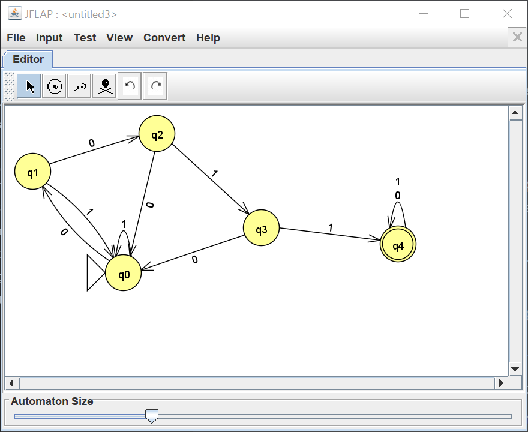

**Now test the state machine by entering strings which contain 0011 and ones that don’t.**

## Nondeterministic Finite Automaton

So far we have been implementing **Deterministic Finite Automaton (DFA).** Deterministic means that we know which state the machine will move into given an input. **Nondeterministic Finite Automaton (NFA)** can change state in a nondeterministic manner, meaning we do not always know which state a machine will enter given an input.

Create the following state machine:

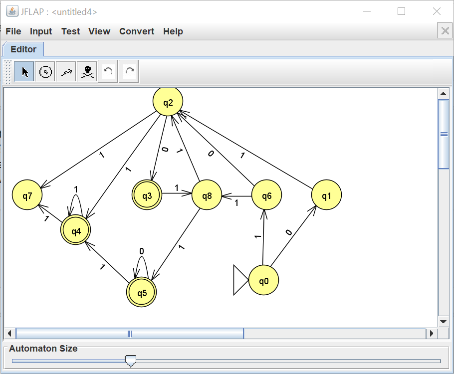

**From the menu, select Test then Highlight Nondeterminism.** The nondeterminism should be presented in a new tab as follows:

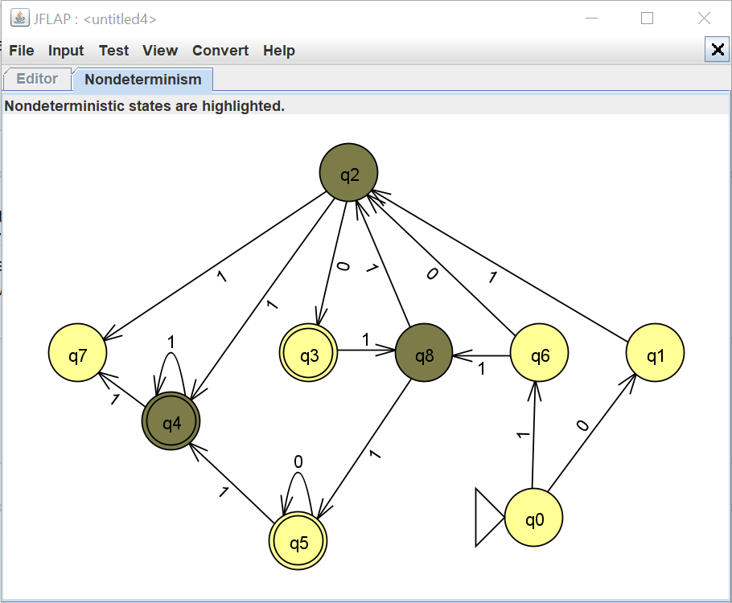

$q2$, $q4$, and $q8$ each have multiple choices for transition with 1.

### Exercise

For the nondeterministic finite automaton can you find:

1. A 4-bit binary string the automaton will always accept?
2. An 8-bit binary string the automaton will accept?

From the Input menu, use the **Step by State** tool to step through the states and see that your answers are correct.