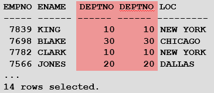
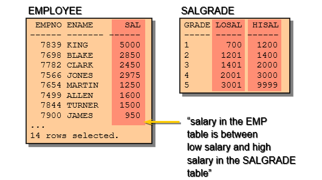
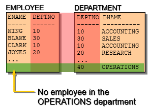
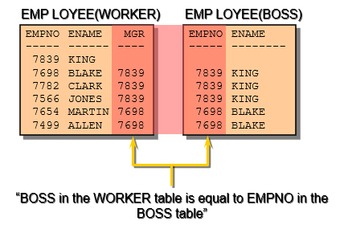

# Databases Lab 7 -- Joining

**This lab is about displaying/ accessing data from multiple tables by *joining* them. Also, the topic covers how to obtain data from more than one table, using different available joining methods.**

Several times the requirement may be as such, that more than one table needs to be accessed to get the desired report displayed. For example, in the database `EmployeeInfo`, `Employee` table has all the information about employee like: employee’s number, name, salary, hiredate, his job and department number in which employee is working in) and in the `Department` table, department’s number, name and it’s location information is available.

We can see the attribute `DEPTNO` exists in both the table. However, if we want to display the employee’s number, name and the location of the department they are working in, then both the tables need to get accessed in the same query.

| **Empno** | **Name** | **……** | **Deptno** |
| --------- | -------- | ------ | ---------- |
| 7839      | King     | ……     | 10         |
| 7698      | Blake    | ……     | 30         |
| ……        | ……       | ……     | ……         |
| 7934      | Miller   | ……     | 10         |

| **Deptno** | **Name**   | **Location** |
| ---------- | ---------- | ------------ |
| 10         | Accounting | New York     |
| 20         | Research   | Dallas       |
| 30         | Sales      | Chicago      |
| 40         | Operations | Boston       |

The expected outcome from the above two tables must be displayed like:

| **Empno** | **Name** | **Location** |
| --------- | -------- | ------------ |
| 7839      | King     | New York     |
| 7698      | Blake    | Chicago      |
| ……        | ……       | ……           |
| 7934      | Miller   | New York     |

To produce the  report, we need to link `Employee` and `Department` tables and access data  from both of them.

## Joining

When data from more than one table in the database is required, a *join* condition is used. Rows in one table can be joined to rows in another table according to common values existing in corresponding columns, that is, usually primary and foreign key columns. 

To display data from two or more related tables, a simple join condition in the WHERE clause in the syntax will look like:

```sql
SELECT table1.column, table2.column
FROM table1, table2
WHERE table1.column1 = table2.column2;
```

`table1.column`  denotes the table and column from which data is retrieved.  `table1.column1 =` is the condition that  joins (or relates) the tables together `table2.column2`.  

### Types of Joins


#### Equijoin

To determine the name of an employee’s department, we compare the value in the `DEPTNO` column in the `EMPLOYEE` table with the `DEPTNO` values in the `DEPARTMENT` table. The relationship between the `EMPLOYEE` and `DEPARTMENT` tables is an equijoin—that is, values in the `DEPTNO` column on both tables must be equal. Frequently, this type of join involves primary and foreign key complements.

Equijoins are also called simple joins or inner joins.


Now, let’s see the syntax of retrieving/accessing data with equijoin:

```sql
SQL> SELECT employee.empno, employee.ename, employee.deptno,  department.deptno, department.loc
FROM  employee, department
WHERE employee.deptno = department.deptno;
```

Here, the `SELECT` clause specifies the column names to access:

- Employee name, employee number, and department number, which are columns in the `EMPLOYEE` table
- Department number, department name, and location, which are columns in the `DEPARTMENT` table

The `FROM` clause specifies the two tables that the database must access:

- `EMPLOYEE` table.
- `DEPARTMENT` table.

The `WHERE` clause specifies how the tables are to be joined:

```sql
EMPLOYEE.DEPTNO = DEPARTMENT.DEPTNO
```

Because the `DEPTNO` column is common to both tables, it must be prefixed by the table name to avoid ambiguity. 



 More than two tables can also be joined using  the same Equijoin method.  

#### Non-Equijoin



The relationship between the `EMPLOYEE` table and the `SALARYGRADE` table is a non-equijoin, means that no column in the `EMPLOYEE` table corresponds directly to a column in the `SALARYGRADE` table. The relationship between the two tables is that the `SAL` column in the `EMPLOYEE` table is between the `LOSAL` and `HISAL` column of the `SALARYGRADE` table. The relationship is obtained using an operator other than equal (=). 

```sql
SQL> SELECT e.ename, e.sal, s.gradebn
     FROM employee e, salarygrade s
     WHERE e.sal BETWEEN s.losal AND s.hisal; 
```


#### Outer Join

If a row does not satisfy a join condition, more elaborately, any of the row will not appear in the query result after performing any equijoin, then we can approach to use outer join. For example, in the equijoin condition of `EMPLOYEE` and `DEPARTMENT` tables, department `OPERATIONS` does not appear because no employee data is recorded as such who works in that department.



The conditions that we need to keep on our mind while doing outer joins are:

- Within the outer join operations the rows which do not usually meet the join conditions.
- Outer Join needs to be specified as, `LEFT` or `RIGHT` join while querying.

 ```sql
SQL> SELECT employee.name, department.deptno, department.name 
     FROM employee
     LEFT JOIN department ON employee.deptno=department.deptno;
 ```

#### Self-Join

In many situations, we need to join a table to itself. For example, in order to find the name of each employee’s manager(where the manager himself is also an employee in the table), you need to join the `EMPLOYEE` table to itself, and this type of joining performed considering this situation are called *self joins*.

For instance, to find the name of Blake’s boss, we need to:

- Find Blake in the `EMPLOYEE` table by looking at the `NAME` column.
- Find the number of the boss for Blake by looking at the `BOSS` column. Blake’s boss is 7839.
- Find the name of the boss with `EMPNO` 7839 by looking at the `NAME` column. King’s employee number is 7839, so King is Blake’s boss. 



In this process, we look in the table twice. The first time you look in the table to find Blake in the `NAME` column and `BOSS` value of 7839. The second time you look in the `EMPNO` column to find 7839 and the `ENAME` column to find King.

```sql
SQL> SELECT worker.name, boss.name
     FROM employee worker, employee boss
     WHERE worker.boss = boss.empno;
```


## Lab Task

1. Before starting with the lab task today, keep the sample tables of `EmployeeInfo` database from Week-5 ready in your MySQL server. You can copy and paste the SQL statements step by step to define the tables and populate them with values as it is provided to you in the file. This task SHOULD NOT take you more than 15 minutes.
2. In `EmployeeInfo` Database, continue executing the following SQLs:
   1. Find the project description, project start date, end date and the employee’s name who are working in those projects.
   2. Find the department’s location and the emaployee’s name who are working in different locations.
   3. Find the employee’s number, name, salary and salarygrade who do not earn more than 3000.
   4. Find the employee’s number department name, location, salary who earn the highest salary among all.
   5. Find the employee’s name and their boss’s name who work in the research department.
   6. Find employee’s number, name, hiredate, department’s name and location in ascending order with their department’s name.
   7. Find the total number of employees working under different roles along with the role description.
   8. Find the project description, start date, end date and the employee’s role description in those projects.

Solutions are available [here](solution).

 