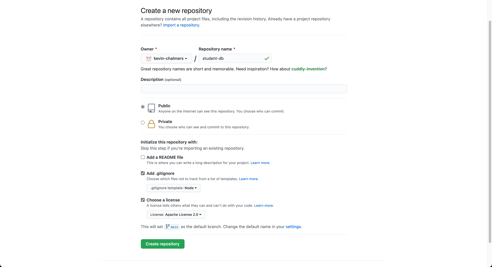
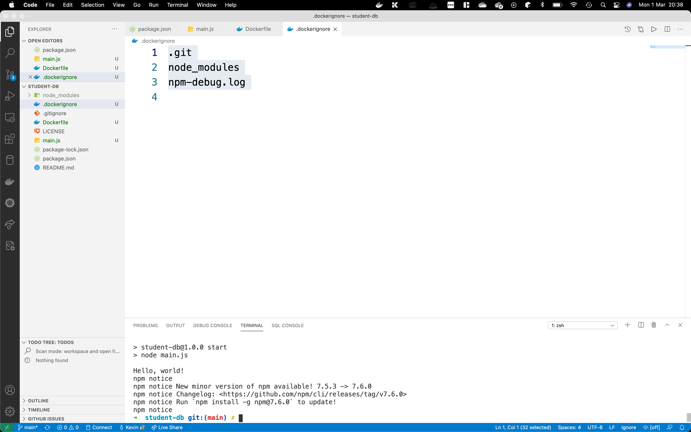
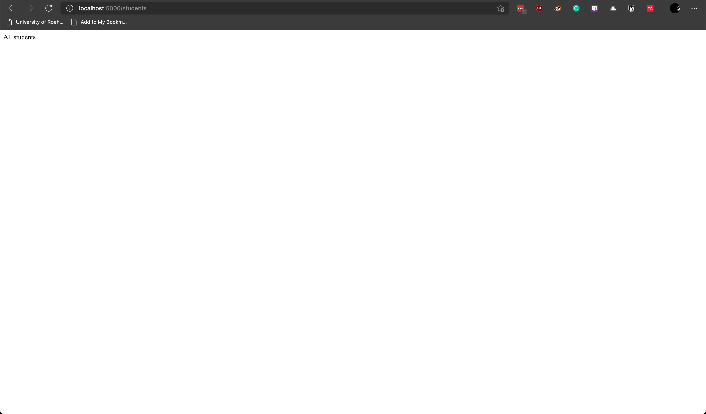

# Software Development 2 Lab 08 -- Case Study: Building the Student Application

In this lab we will put together all the components we have been discussing throughout the module to complete our Student Database application. There is quite a lot to do, and it is expected that this lab will take a significant time (more than one week) to complete.

## Basic Application Architecture


**TODO**


## Requirements

Our Student Database system is designed to manage students at university, including their programme of study, the modules on the programme, and the students grades on their modules. The application is designed for both administrators to manage student data, and for students to update their personal data and see their module results. Let us first define our set of user stories for this application.

### User Stories

Our user stories are focused on administrators and students. We will keep these brief for simplicities sake, but there are a number of other user stories we could consider.

1. As an administrator, I want to add a module to the system so we can attach marks to a student.
2. As an administrator, I want to add a programme to the system so I can enrol students on a programme.
3. As an administrator, I want to add a module to a programme so students know which modules they are studying.
4. As an administrator, I want to add a student to the system so I can enrol students to programmes and therefore modules.
5. As an administrator, I want to enter module marks for a student so they can know how they are progressing.
6. As a student, I want to see my module marks soI know how I am progressing with my studies.
7. As a student, I want to update my personal details so the university has the correct information.

### Use Case Diagrams


**TODO**


### Activity Diagrams


**TODO**


### Database Design


**TODO**


### Frontend Design


**TODO**


## Logistics -- GitHub, `npm` and Docker

### GitHub Setup




### `npm`


```json
{
  "name": "student-db",
  "version": "1.0.0",
  "description": "",
  "main": "main.js",
  "scripts": {
    "start": "node main.js",
    "test": "echo \"Error: no test specified\" && exit 1"
  },
  "repository": {
    "type": "git",
    "url": "git+https://github.com/kevin-chalmers/student-db.git"
  },
  "author": "Kevin Chalmers",
  "license": "Apache-2.0",
  "bugs": {
    "url": "https://github.com/kevin-chalmers/student-db/issues"
  },
  "homepage": "https://github.com/kevin-chalmers/student-db#readme"
}

```


`npm install express`


`npm install sqlite3`


```json
{
  "name": "student-db",
  "version": "1.0.0",
  "description": "",
  "main": "main.js",
  "scripts": {
    "start": "node main.js",
    "test": "echo \"Error: no test specified\" && exit 1"
  },
  "repository": {
    "type": "git",
    "url": "git+https://github.com/kevin-chalmers/student-db.git"
  },
  "author": "Kevin Chalmers",
  "license": "Apache-2.0",
  "bugs": {
    "url": "https://github.com/kevin-chalmers/student-db/issues"
  },
  "homepage": "https://github.com/kevin-chalmers/student-db#readme",
  "dependencies": {
    "express": "^4.17.1",
    "sqlite3": "^5.0.2"
  }
}
```


Git commit


```javascript
console.log("Hello, world!");
```


`npm start`


Git commit.


### Docker Setup


```dockerfile
# Base image to use
FROM node:latest

# Create application directory
WORKDIR /usr/src/app

# Install application dependencies
# Copy across project configuration information
COPY package*.json ./

# Ask npm to install the dependencies
RUN npm install

# Copy across all our files
COPY . .

# Expose our application port (3000)
EXPOSE 3000

# On start, run the application using npm
ENTRYPOINT ["npm", "start"]
```


```txt
.git
node_modules
npm-debug.log
```


`docker build -t student-database .`


`docker run --rm student-database`





Git commit.


## Backend Setup

### Folder Structure

```txt
\---app
|       app.js
|
\---data
|       data.js
|       student.db
|
+---node_modules
|
\---static
|       index.html
|       index.js
|   .dockerignore
|   .gitignore
|   Dockerfile
|   LICENSE
|   main.js
|   package-lock.json
|   package.json
|   README.md
```


Git commit.


### Endpoints

1. Module
2. Modules
3. Programme
4. Programmes
5. Student
6. Students


```javascript
"use strict";

// The application layer talks to the data layer
const data = require("../data/data.js");

// Import express library.
const express = require("express");

// Create express application
var app = express();

// Add static files location
app.use(express.static("static"));

// Add /module endpoint
app.get("/module/:code", function(req, res) {
    // Return "Module <code>"
    res.send("Module " + req.params.code);
});

// Add /modules endpoint
app.get("/modules", function(req, res) {
    // Return "All modules"
    res.send("All modules");
});

// Add /programme endpoint
app.get("/programme/:code", function(req, res) {
    // Return "Programme <code>"
    res.send("Programme " + req.params.code);
});

// Add /programmes endpoint
app.get("/programmes", function(req, res) {
    // Return "All programmes"
    res.send("All programmes");
});

// Add /student endpoint
app.get("/student/:id", function(req, res) {
    // Return "Student <id>"
    res.send("Student " + req.params.id);
});

// Add /students endpoint
app.get("/students", function(req, res) {
    // Return "All students"
    res.send("All students");
});

// Start listening on port 3000
app.listen(3000, function(err) {
    if (err) {
        return console.error(err.message);
    }
    console.log("Server started.");
});
```


```javascript
"use strict";

// Include the app.js file.
// This will run the code.
const app = require("./app/app");
```


### Testing


`docker build -t student-database .`


`docker run -d --rm -p 5000:3000`





`docker ps`


```shell
CONTAINER ID   IMAGE              COMMAND       CREATED              STATUS              PORTS                    NAMES
974905b65c5c   student-database   "npm start"   About a minute ago   Up About a minute   0.0.0.0:5000->3000/tcp   wonderful_dijkstra
```


`docker stop wonderful_dijkstra`


Git commit


## Talking to Our Database

Database link.

### SQL Statements

### Testing

## Frontend Setup

### More Angular

### Testing

## Talking to Our Backend

### Requesting Data

#### Testing

### Updating Data

#### Testing

## Workflow

1. Design enough of the system (e.g., user stories, diagrams, database design, frontend design).
2. Populate some of the database.
3. Setup GitHub repository and pull.
4. Initialise project using npm.
   1. Add any dependencies.
   2. Add start script
5. Create Dockerfile (runtime environment)
6. Create folder structure.
7. Create Express.js endpoints -- remember the static pages.
8. Do a test, via Docker, to make sure you can access the endpoints.
9. Turn endpoints into SQL statements and return JSON.
   1. Test each one as you build.
10. Add a frontend page (e.g., student.html).
11. Use dummy data to test frontend page works.
12. Repeat steps 10 and 11 for each page.
13. Change dummy data to talk to correct Express.js endpoints.
    1. Start with requesting pages.
    2. Do updating pages later.
14. Test each addition.
15. Repeat 13 and 14 until all pages talk to the backend.
16. Finish.