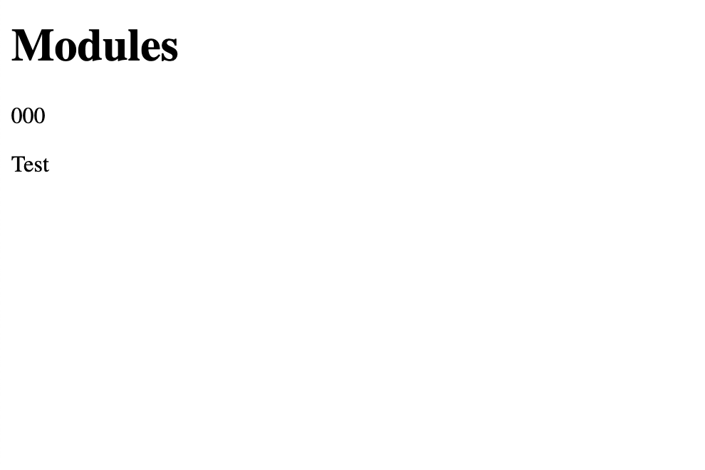
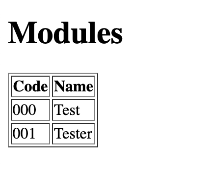
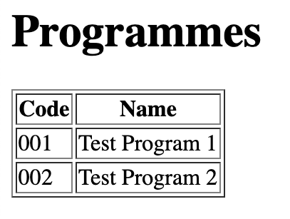
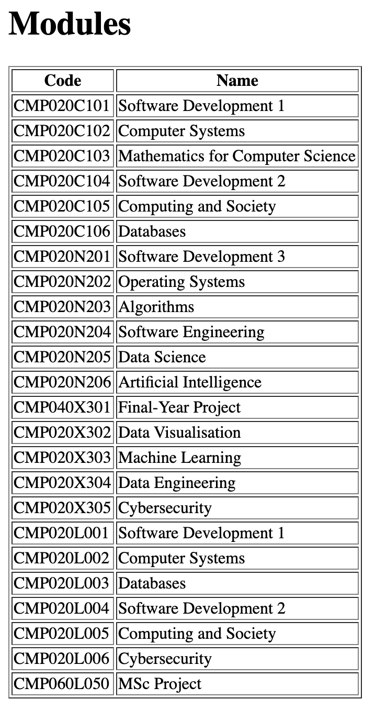
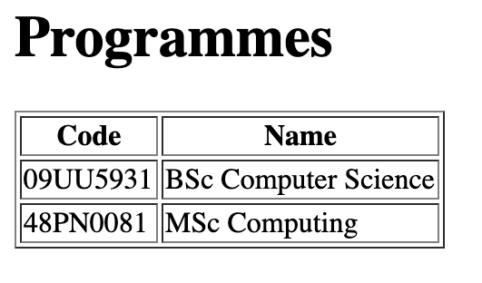
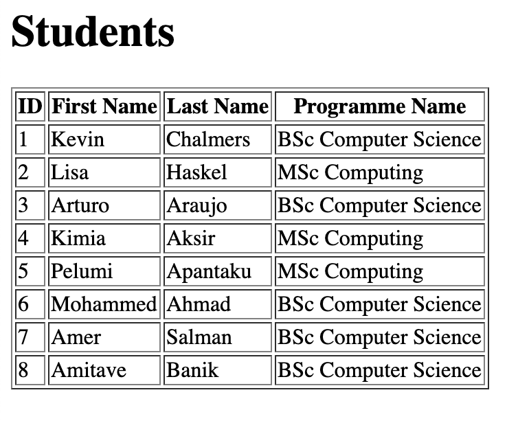
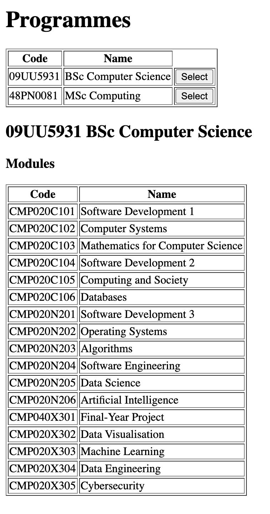
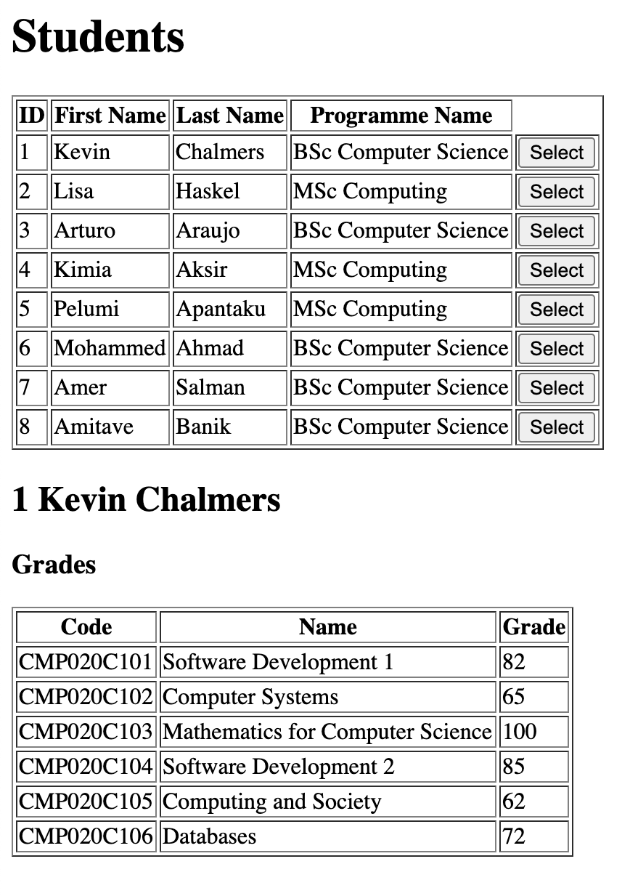

# Software Development 2 Lab 09 -- Case Study Part 2

In this second part of the case study, we will initially create some frontend webpages and then connect them to our backend Node application. You will need to have completed Part 1 of the Case Study to complete this part.

## Frontend Design

Our frontend will feature three pages -- `all_students.html`, `all_modules.html` and `all_programmes.html`.

- **Add these three files to your `static` folder now.**

Each frontend page also needs a JavaScript file -- `all_students.js`, `all_modules.js` and `all_programmes.js`.

- **Add these three files to your `static` folder now.**


**TODO**


## Frontend Setup

- **In the `static` folder of your project, add the following file `student.js`. It is fundamentally the same as our `student.js` from the backend, except we do not `export` our classes.**

```javascript
"use strict";

class Student {
    // Student ID
    id;
    // Student first name
    first_name;
    // Student last name
    last_name;
    // Student programme
    programme;
    // Student modules and grades
    modules = [];

    constructor(id, first_name, last_name, programme) {
        this.id = id;
        this.first_name = first_name;
        this.last_name = last_name;
        this.programme = programme;
    }
}

class Programme {
    // Programme code
    code;
    // Programme name
    name;
    // Programme modules
    modules = [];

    constructor(code, name) {
        this.code = code;
        this.name = name;
    }
}

class Module {
    // Module code
    code;
    // Module name
    name;

    constructor(code, name) {
        this.code = code;
        this.name = name;
    }
}
```

- **Commit your changes to GitHub**
  - **Add the changes.**
  - **Commit the changes.**
  - **Push to GitHub**

### Modules Page

We will first create a simple version of our modules page. It will just display a single module code and name using AngularJS.

- **Enter the following into the `all_modules.js` file.**
  - Note the scripts we import.
  - We are just doing some standard AngularJS embeds for a module code and name.

```html
<!DOCTYPE html>
<html>
  <head>
    <title>Modules</title>
    <script src="https://ajax.googleapis.com/ajax/libs/angularjs/1.8.0/angular.js"></script>
    <script src="student.js"></script>
    <script src="all_modules.js"></script>
  </head>
  <body>
    <h1>Modules</h1>
    <div ng-app="mainApp" ng-controller="moduleController">
      <p>{{ "{{ module.code "}}}}</p>
      <p>{{ "{{ module.name "}}</p>
    </div>
  </body>
</html>
```

- **Enter the following into `all_modules.js`**
  - Note that we just create a dummy module right now. This is for testing purposes.
  - We will be using `$http` later to get our data from our server.

```javascript
"use strict";

// Get the mainApp
var mainApp = angular.module("mainApp", []);

// Create the controller
mainApp.controller("moduleController", function($scope, $http) {
  $scope.module = new Module("000", "Test");
});
```

- **Rebuild your Docker image using the following command:`docker build -t student-database .`**
- **Run the Docker image as a container with the following command: `docker run -d --rm -p 5000:3000 student-database`**
- **Open your browser and visit `localhost:5000/all_modules.html`. You should receive this as the result.**



- **Stop your Docker container. Remember to use `docker ps` to find the container ID and `docker stop` to stop it.**
- **Commit your changes to GitHub**
  - **Add your changes.**
  - **Commit your changes.**
  - **Push your changes.**

Displaying one module is fine, but we have many modules to display, and that will be tedious to type. Thankfully, AngularJS provides a `ng-repeat` to iterate across a collection of data.

- **Update the `div` in `all_modules.html` to the following.**
  - We have created a table with column headers `Code` and `Name`.
  - We use `ng-repeat` to create a row for each `module` in `modules`.
  - We create an entry for the `code` and `name` of each module.

```html
<div ng-app="mainApp" ng-controller="moduleController">
  <table border=1>
    <tr>
      <th>Code</th>
      <th>Name</th>
    </tr>
    <tr ng-repeat = "module in modules">
      <td>{{ "{{ module.code "}}}}</td>
      <td>{{ "{{ module.name "}}}}</td>
    </tr>
  </table>
</div>
```

- **Now we need to create `modules` data in our controller in `all_modules.js`. Update the controller to the following:**

```javascript
mainApp.controller("moduleController", function($scope, $http) {
  $scope.modules = [
    new Module("000", "Test"),
    new Module("001", "Tester")
  ];
});
```

- **Rebuild your Docker image using the following command:`docker build -t student-database .`**
- **Run the Docker image as a container with the following command: `docker run -d --rm -p 5000:3000 student-database`**
- **Open your browser and visit `localhost:5000/all_modules.html`. You should receive this as the result.**



- **Stop your Docker container. Remember to use `docker ps` to find the container ID and `docker stop` to stop it.**
- **Commit your changes to GitHub**
  - **Add your changes.**
  - **Commit your changes.**
  - **Push your changes.**

We will now repeat this process for `all_programmes.html` and `all_students.html`.

### Programmes Page

- **Add the following HTML to `all_programmes.html`**

```html
<!DOCTYPE html>
<html>
  <head>
    <title>Programmes</title>
    <script src="https://ajax.googleapis.com/ajax/libs/angularjs/1.8.0/angular.js"></script>
    <script src="student.js"></script>
    <script src="all_programmes.js"></script>
  </head>
  <body>
    <h1>Programmes</h1>
    <div ng-app="mainApp" ng-controller="programmeController">
      <table border=1>
        <tr>
          <th>Code</th>
          <th>Name</th>
        </tr>
        <tr ng-repeat = "programme in programmes">
          <td>{{ "{{ programme.code "}}}}</td>
          <td>{{ "{{ programme.name "}}}}</td>
        </tr>
      </table>
    </div>
  </body>
</html>
```

- **Add the following to `all_programmes.js`**

```javascript
"use strict";

// Get the mainApp
var mainApp = angular.module("mainApp", []);

// Create the controller
mainApp.controller("programmeController", function($scope, $http) {
  $scope.programmes = [
    new Programme("001", "Test Program 1"),
    new Programme("002", "Test Program 2")
  ];
});
```

- **Rebuild your Docker image using the following command:`docker build -t student-database .`**
- **Run the Docker image as a container with the following command: `docker run -d --rm -p 5000:3000 student-database`**
- **Open your browser and visit `localhost:5000/all_programmes.html`. You should receive this as the result.**



- **Stop your Docker container. Remember to use `docker ps` to find the container ID and `docker stop` to stop it.**
- **Commit your changes to GitHub**
  - **Add your changes.**
  - **Commit your changes.**
  - **Push your changes.**

### Students Page

- **Add the following HTML to `all_students.html`**

```html
<!DOCTYPE html>
<html>
  <head>
    <title>Students</title>
    <script src="https://ajax.googleapis.com/ajax/libs/angularjs/1.8.0/angular.js"></script>
    <script src="student.js"></script>
    <script src="all_students.js"></script>
  </head>
  <body>
    <h1>Students</h1>
    <div ng-app="mainApp" ng-controller="studentController">
      <table border=1>
        <tr>
          <th>ID</th>
          <th>First Name</th>
          <th>Last Name</th>
          <th>Programme Name</th>
        </tr>
        <tr ng-repeat = "student in students">
          <td>{{ "{{ student.id "}}}}</td>
          <td>{{ "{{ student.first_name "}}}}</td>
          <td>{{ "{{ student.last_name "}}}}</td>
          <td>{{ "{{ student.programme.name "}}}}</td>
        </tr>
      </table>
    </div>
  </body>
</html>
```

- **Add the following to `all_students.js`**

```javascript
"use strict";

// Get the mainApp
var mainApp = angular.module("mainApp", []);

// Create the controller
mainApp.controller("studentController", function($scope, $http) {
  $scope.students = [
    new Student("001", "Test", "Test", new Programme("001", "Test")),
    new Student("002", "Tester", "Tester", new Programme("002", "Test 2"))
  ];
});
```

- **Rebuild your Docker image using the following command:`docker build -t student-database .`**
- **Run the Docker image as a container with the following command: `docker run -d --rm -p 5000:3000 student-database`**
- **Open your browser and visit `localhost:5000/all_students.html`. You should receive this as the result.**


- **Stop your Docker container. Remember to use `docker ps` to find the container ID and `docker stop` to stop it.**
- **Commit your changes to GitHub**
  - **Add your changes.**
  - **Commit your changes.**
  - **Push your changes.**

## Talking to Our Backend

So far we have been using dummy data just to test that our application works as expected. Let us now get the real data from our backend.

### Requesting Data

The `$http` part of AngularJS we have included in our controller allows us to make HTTP requests. For example, we can use `$http.get` to get data from our backend. Let us do so for the modules first.

#### Modules

- **Modify the controller in `all_modules.js` to the following**.
  - We use `$http.get` on `/modules` -- remember `/modules` is the endpoint we defined that returns all the modules.
  - When the call returns, the function we've defined sets `$scope.modules` to the data returned from the `get` request.

```javascript
mainApp.controller("moduleController", function($scope, $http) {
  $http.get('/modules').then(function(response) {
    $scope.modules = response.data;
  });
});
```

- **Rebuild your Docker image using the following command:`docker build -t student-database .`**
- **Run the Docker image as a container with the following command: `docker run -d --rm -p 5000:3000 student-database`**
- **Open your browser and visit `localhost:5000/all_modules.html`. You should receive this as the result.**



- **Stop your Docker container. Remember to use `docker ps` to find the container ID and `docker stop` to stop it.**
- **Commit your changes to GitHub**
  - **Add your changes.**
  - **Commit your changes.**
  - **Push your changes**

#### Programmes

- **Modify the controller in `all_programmes.js` to the following.**

```javascript
mainApp.controller("programmeController", function($scope, $http) {
  $http.get("/programmes").then(function(response) {
    $scope.programmes = response.data;
  });
});
```

- **Rebuild your Docker image using the following command:`docker build -t student-database .`**
- **Run the Docker image as a container with the following command: `docker run -d --rm -p 5000:3000 student-database`**
- **Open your browser and visit `localhost:5000/all_programmes.html`. You should receive this as the result.**



- **Stop your Docker container. Remember to use `docker ps` to find the container ID and `docker stop` to stop it.**
- **Commit your changes to GitHub**
  - **Add your changes.**
  - **Commit your changes.**
  - **Push your changes**

#### Students

- **Modify the controller in `all_students.js` to the following.**

```javascript
// Create the controller
mainApp.controller("studentController", function($scope, $http) {
  $http.get("/students").then(function(response) {
    $scope.students = response.data;
  });
});
```

- **Rebuild your Docker image using the following command:`docker build -t student-database .`**
- **Run the Docker image as a container with the following command: `docker run -d --rm -p 5000:3000 student-database`**
- **Open your browser and visit `localhost:5000/all_students.html`. You should receive this as the result.**



- **Stop your Docker container. Remember to use `docker ps` to find the container ID and `docker stop` to stop it.**
- **Commit your changes to GitHub**
  - **Add your changes.**
  - **Commit your changes.**
  - **Push your changes**

## Selecting Data

Now that we can present all the modules, programmes, and students, what about displaying an individual entry? There are a few ways we can do this, but one simple method is to use a separate `<div>` under our current table. We will add a button to each row to allow it to be selected.

### Programmes

- **Update the main `<div>` in `all_programmes.html` to the following**
  - We've added a button to each row, which when clicked calls the `selectProgramme` function. We will need to implement this function.
  - We've added a new `<div>` with `id=selected`. It will contain the programme code and name as a header, and then lists all the modules of `selectedProgramme`. We will have to set this `selectedProgramme` in our `selectProgramme` function.

```html
<div ng-app="mainApp" ng-controller="programmeController">
  <table border=1>
    <tr>
      <th>Code</th>
      <th>Name</th>
    </tr>
    <tr ng-repeat = "programme in programmes">
      <td>{{ "{{ programme.code "}}}}</td>
      <td>{{ "{{ programme.name "}}}}</td>
      <td><input type="button" ng-click="selectProgramme(programme.code)" value="Select"></td>
    </tr>
  </table>

  <div id="selected">
    <h2>{{ "{{ selectedProgramme.code "}}}} {{ "{{ selectedProgramme.name "}}}}</h2>
    <h3>Modules</h3>
    <table border=1>
      <tr>
        <th>Code</th>
        <th>Name</th>
      </tr>
      <tr ng-repeat="module in selectedProgramme.modules">
        <td>{{ "{{ module.code "}}}}</td>
        <td>{{ "{{ module.name "}}}}</td>
      </tr>
    </table>
  </div>
</div>
```

- **Update the controller in `all_programmes.js` to the following**.
  - At the start we hide the `selected` element by setting the display style to `none`.
  - `selectProgramme` uses `$http.get` on the `/programme/code` endpoint, and once returned sets `selectedProgramme` and displays the `selected` element by setting the display style to `block`.

```javascript
mainApp.controller("programmeController", function($scope, $http) {
  // Initially hides the "selected" element
  document.getElementById("selected").style.display="none";

  $http.get("/programmes").then(function(response) {
    $scope.programmes = response.data;
  });

  $scope.selectProgramme = function(code) {
    // Get specific programme by code
    $http.get("/programme/" + code).then(function(response) {
      $scope.selectedProgramme = response.data;
      // Show the "selected" element
      document.getElementById("selected").style.display="block";
    });
  }
});
```

- **Rebuild your Docker image using the following command:`docker build -t student-database .`**
- **Run the Docker image as a container with the following command: `docker run -d --rm -p 5000:3000 student-database`**
- **Open your browser and visit `localhost:5000/all_programmes.html`. You should receive this as the result when you click Select on BSc Computer Science.**



- **Stop your Docker container. Remember to use `docker ps` to find the container ID and `docker stop` to stop it.**
- **Commit your changes to GitHub**
  - **Add your changes.**
  - **Commit your changes.**
  - **Push your changes**

Now all we need to do is repeat this process for `all_students.html` and `all_students.js`.

### Students

- **Update the main `<div>` in  `all_students.html` to the following:**

```html
<div ng-app="mainApp" ng-controller="studentController">
  <table border=1>
    <tr>
      <th>ID</th>
      <th>First Name</th>
      <th>Last Name</th>
      <th>Programme Name</th>
    </tr>
    <tr ng-repeat = "student in students">
      <td>{{ "{{ student.id "}}}}</td>
      <td>{{ "{{ student.first_name "}}}}</td>
      <td>{{ "{{ student.last_name "}}}}</td>
      <td>{{ "{{ student.programme.name "}}}}</td>
      <td><input type="button" ng-click="selectStudent(student.id)" value="Select"></td>
    </tr>
  </table>
  <div id="selected">
    <h2>{{ "{{ selectedStudent.id "}}}} {{ "{{ selectedStudent.first_name "}}}} {{ "{{ selectedStudent.last_name "}}}}</h2>
    <h3>Grades</h3>
    <table border="1">
      <tr>
        <th>Code</th>
        <th>Name</th>
        <th>Grade</th>
      </tr>
      <tr ng-repeat = "module in selectedStudent.modules">
        <td>{{ "{{ module.module.code "}}}}</td>
        <td>{{ "{{ module.module.name "}}}}</td>
        <td>{{ "{{ module.grade ßtd>
      </tr>
    </table>
  </div>
</div>
```

- **Update the controller in `all_students.js` to the following.**

```javascript
mainApp.controller("studentController", function($scope, $http) {
  // Initially hides the "selected" element
  document.getElementById("selected").style.display="none";

  $http.get("/students").then(function(response) {
    $scope.students = response.data;
  });

  $scope.selectStudent = function(id) {
    // Get student by id
    $http.get("/student/" + id).then(function(response) {
      $scope.selectedStudent = response.data;
      // Show the selected element
      document.getElementById("selected").style.display="block";
    });
  }
});
```

- **Rebuild your Docker image using the following command:`docker build -t student-database .`**
- **Run the Docker image as a container with the following command: `docker run -d --rm -p 5000:3000 student-database`**
- **Open your browser and visit `localhost:5000/all_students.html`. You should receive this as the result when you click Select on Kevin Chalmers.**



- **Stop your Docker container. Remember to use `docker ps` to find the container ID and `docker stop` to stop it.**
- **Commit your changes to GitHub**
  - **Add your changes.**
  - **Commit your changes.**
  - **Push your changes**

