# Software Development 1 Lab 01 -- Introduction to Python

**Aim** -- to draw flags of the world using just code with Python.

To complete this worksheet, you will need to use Python. We will use Anaconda as a platform. Watch the following video.

**TODO -- installing Anaconda Python**

## Advice before Starting

The **computer is stupid**. It needs to know exactly what you mean when you give it instructions. It has no ability to guess. To become a programmer, you have to work on three skills as a beginner:

- **Precision** -- you need to **type instructions exactly as given**. The computer is case sensitive, it will treat uppercase and lowercase letters differently. The computer cannot guess your spelling mistakes. You need to be precise when entering instructions.
- **Patience** -- you need to be patient when learning to program. You will make mistakes, and the computer will shout at you. Your job is to recognise your errors and start building your programming capability.
- **Practice** -- you have to **constantly practice**. You cannot write a few lines of code and think you are a programmer. You have to build up a certain type of problem solving skill to talk to the computer and write high-quality software.

## Setting Up Python

**TODO -- starting Anaconda**

We must install an additional package to work with graphics in Python.

- **Enter the following *precisely* in the command line interface.**

```shell
pip install graphics.py
```

- **We can now start Python by entering the following into the command line interface.**

```shell
python
```

This will start the Python interpreter. It should look something as follows:

```shell
Python 3.9.0 (default, Oct 27 2020, 14:15:17) 
[Clang 12.0.0 (clang-1200.0.32.21)] on darwin
Type "help", "copyright", "credits" or "license" for more information.
>>> 
```

- **The first thing we have to do is ask Python to import our graphics library.**

```python
from graphics import *
```

## Creating a Graphics Window in Python

We are going to draw graphics to a window. Let us perform the following steps:

1. Open a graphics window.
2. Set its background to white.
3. Close the graphics window.

- **This is accomplished with the following lines of code. Enter them *precisely* into Python.**

```python
win = GraphWin()
win.setBackground(‘white’)
win.close()
```

## Graphics Coordinate Systems

Windows have coordinates. `(0, 0)` is the top-left corner. `(w, h)` is the bottom-right corner -- where `w` is the window width and `h` the height.


## Drawing Circles

Circles have a centre (in coordinates) and a radius. We can also set the colour of our circle. Let us do the following:

1. Create a graphics window. Let's call the window `Flag` and set the size to 600 by 400.
2. Create a circle with centre at (100, 100) and radius 50.
3. Set the fill colour of the circle to red.
4. Draw the circle to the window.

- **Try the following code in Python.**

```python
win = GraphWin("Flag", 600, 400)
circle = Circle(Point(300, 200), 100)
circle.setFill(‘red’)
circle.draw(win)
```

Congratulations. You have just drawn the Japanese flag.

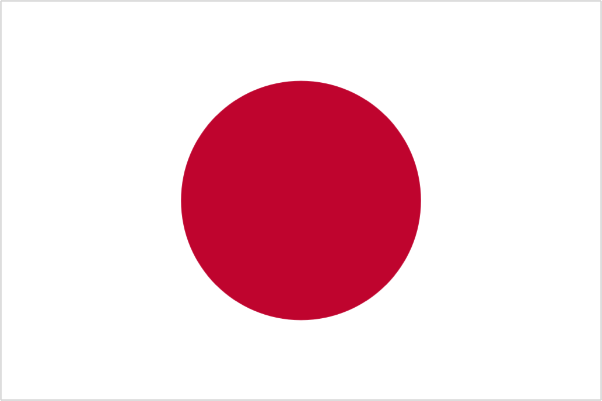

- **Close the window using the following.**

```python
win.close()
```

## Drawing Rectangles

A rectangle has a start point and an end point. We can also set its colour. Let us do the following:

1. Create a graphics window called `name` with a size of 600 by 400.
2. Create a rectangle from point (0, 0) to point (100, 200).
3. Set the rectangle colour to blue.
4. Draw the rectangle.

- **Try drawing the rectangle now using the following code in Python.**

```python
france = GraphWin("France", 600, 400)
rect = Rectangle(Point(0, 0), Point(200, 400))
rect.setFill("blue")
rect.draw(france)
```

### Now You Try -- Completing the French Flag

You have now started drawing the French flag. You can complete the flag by drawing two more rectangles. For reference, here is a visual aid.

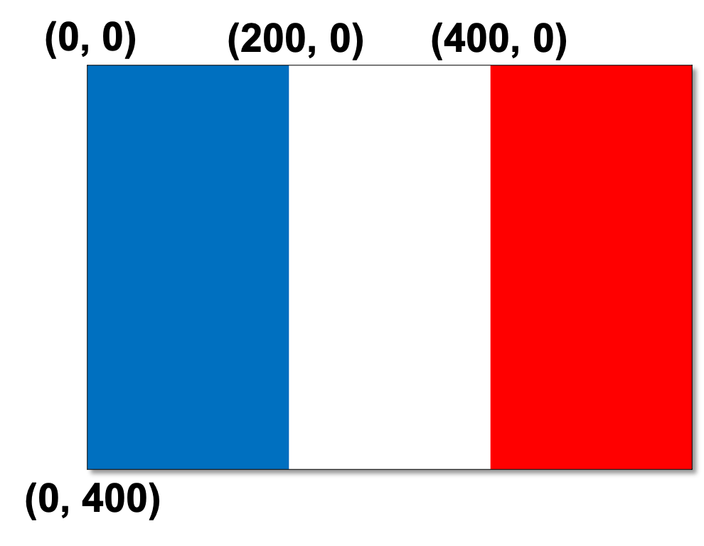

- **If you cannot complete this, the following code will complete the flag.**

```python
rect = Rectangle(Point(200, 0), Point(400, 400))
rect.setFill(‘white’)
rect.draw(france)
rect = Rectangle(Point(400, 0), Point(600, 400))
rect.setFill(‘red’)
rect.draw(france)
```

- **Remember to close the window when you are finished.**

```python
france.close()
```

### Now You Try -- More Flags

Write code to draw the following flags.

- **Indonesia**

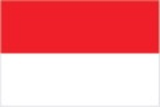

- **Poland**

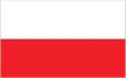

- **Austria**

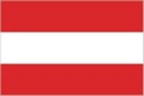

- **Gabon**

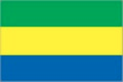

- **Yemen**

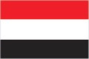

- **Mauritius**

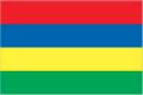

- **Italy**

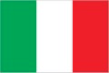

- **Mali**

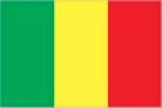

- **UAE**

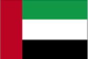

- **Gambia**

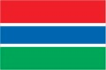

- **Thailand**


- **Laos**

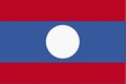

- **Maldives**

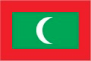