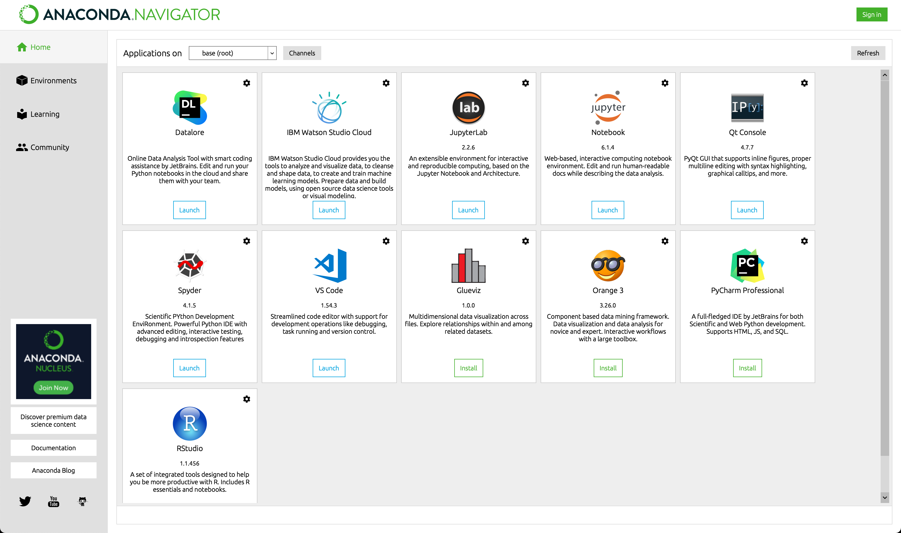
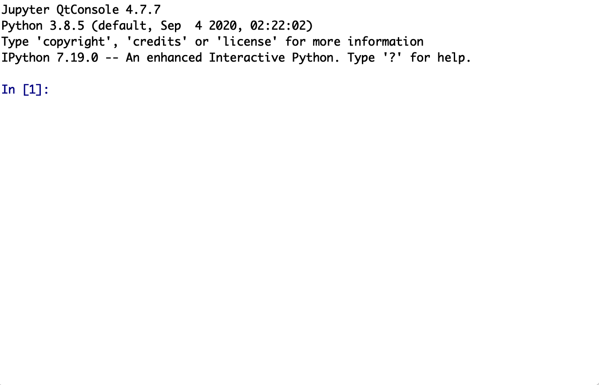
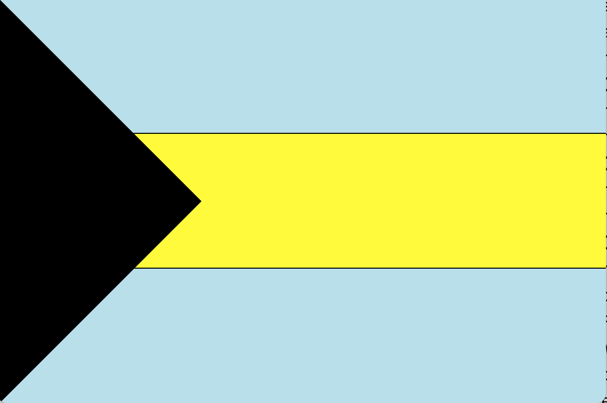
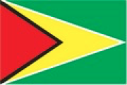
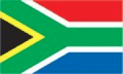
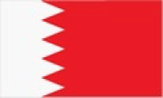

# Software Development 1 Lab 02 -- Basic Syntax and Semantics of a High-Level Language

**Aim** -- recognise the syntax (permitted input) and semantics (input meaning) of Python.

We will continue to use Python and draw some more flags, but start to recognise correct input and meaning.

1. Open **Anaconda Navigator** from your Start Menu (Windows), Launchpad (MacOS), or equivalent on Linux.

2. Once started, you will be presented with the following window.

   

3. Click Launch under Qt Console.

4. This will open a **Command Line Interface** window similar to the following:

   

We must install an additional package to work with graphics in Python.

- **Enter the following *precisely* into the command line interface.**

```shell
pip install graphics.py
```

- **Next we have to do is ask Python to import our graphics library.**

```python
from graphics import *
```

## Advice before Starting

The **computer is stupid**. It needs to know exactly what you mean when you give it instructions. It has no ability to guess. To become a programmer, you have to work on three skills as a beginner:

- **Precision** -- you need to **type instructions exactly as given**. The computer is case sensitive, it will treat uppercase and lowercase letters differently. The computer cannot guess your spelling mistakes. You need to be precise when entering instructions.
- **Patience** -- you need to be patient when learning to program. You will make mistakes, and the computer will shout at you. Your job is to recognise your errors and start building your programming capability.
- **Practice** -- you have to **constantly practice**. You cannot write a few lines of code and think you are a programmer. You have to build up a certain type of problem solving skill to talk to the computer and write high-quality software.

## Syntax

You've been drawing flags using the following instructions:

- `Circle(centre, radius)` where `centre` is two-dimensional `Point` and `radius` a number.
- `Rectangle(top-left, bottom-right)` where `top-left` and `bottom-right` are both two-dimensional `Point`s.

If we were to define any of the `Point` values as just a number, we would have a syntax error. We have defined a program that uses input that is not permitted.

```python
# This instruction breaks syntax
circle = Circle(5.0, 2.0)
```

**Knowing syntax rules allows you to create instructions that the computer will understand. They take *practice* to help you remember syntax rules automatically, thus allowing you to focus on the semantics of your program.**

Some rules that govern the syntax of Python:

- `name = value` assigns a name with a value. The value can change during the lifetime of a program.
- `name = value + value * value - value` uses standard arithmetic rules to calculate the value to store in `name`. You should be familiar with these basic rules form your previous study of mathematics. We will examine expressions next week.
- `name = Type(value, ...)` allows us to create values of a given type -- such as a `Rectangle` -- and assign them to a `name`. We will examine types later in the module.
- `value.function(value, ...)` allows us to call a function on a value. We will explore functions later in the module.

## Semantics

Semantics are the meaning of your lines of code. **Knowing the meaning of code is the key skill. Mixing up a language's way of doing something with the meaning is a common error novice programmers make.** For example, consider our first program to draw the flag of France:

```python
rect = Rectangle(Point(0, 0), Point(200, 400))
rect.setFill("blue")
rect.draw(france)
rect = Rectangle(Point(200, 0), Point(400, 400))
rect.setFill(‘white’)
rect.draw(france)
rect = Rectangle(Point(400, 0), Point(600, 400))
rect.setFill(‘red’)
rect.draw(france)
france.close()
```

The **meaning** of this program, line-by-line, is:

```
Create a graphics window 600 by 400 pixels in size
Create a rectangle from point (0, 0) to point (200, 400)
Set the colour of the rectangle to blue
Draw the rectangle in the graphics window
Create a rectangle from point (200, 0) to point (400, 400)
Set the colour of the rectangle to white
Draw the rectangle in the graphics window
Create a rectangle from point (400, 0) to point (600, 400)
Set the colour of the rectange to red
Draw the rectangle in the graphics window
Close the graphics window
```

Our high-level meaning of the program is:

```
Draw a blue rectangle on the left third of the flag
Draw a white rectangle on the centre third of the flag
Draw a red rectangle on the right third of the flag
```

## Drawing Polygons

Let us apply our new understanding to draw flags using polygons. Our aim is to draw the following flag of the Bahamas:


This might look complicated, but let us break it down into a high-level meaning.

- **Ensure you study and understand the meaning of our solution. Does it make sense?**

```
Draw a light blue rectangle on the top third of the flag
Draw a yellow rectangle on the middle third of the flag
Draw a light blue rectangle on the bottom third of the flag
Draw a black triangle on the left of the flag
```

**The black triangle will be drawn on top of the rectangles, just as it would be if you did this in real-life.** Being able to break down this problem is another key skill we are working on.

A polygon is a shape that has a finite number of straight edges. You already know some polygons:

- Triangle -- 3-sided polygon
- Rectangle -- 4-sided polygon with each angle being 90 degrees

A polygon is defined by a **list** of points. For example, we can define a triangle as:

```python
triangle = Polygon(Point(0, 0), Point(200, 200), Point(0, 400))
```

**This is the syntax for polygon creation. With this we can write code that has the right meaning.**

Now let us define the flag of the Bahamas.

- **Enter this code, line-by-line, in the interactive Python console window.**

```python
from graphics import *
bahamas = GraphWin("Bahamas", 600, 400)
rect = Rectangle(Point(0, 0), Point(600, 133))
rect.setFill("light blue")
rect.draw(bahamas)
rect = Rectangle(Point(0, 133), Point(600, 266))
rect.setFill("yellow")
rect.draw(bahamas)
rect = Rectangle(Point(0, 266), Point(600, 400))
rect.setFill("light blue")
rect.draw(bahamas)
triangle = Polygon(Point(0, 0), Point(200, 200), Point(0, 400))
triangle.setFill("black")
triangle.draw(bahamas)
```

You should have the following output:



## Now you try

Write code to draw the following flags.

- **Sudan**


- **Kuwait**


- **Guyana**



- **St. Vincent**


- **Jamaica**


- **Seychelles**


- **South Africa**



- **Bahrain**



- **North Macedonia**


