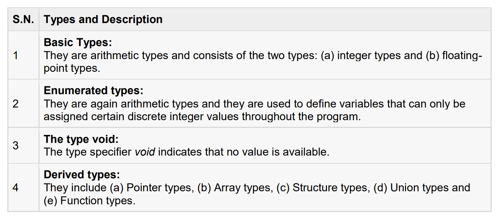
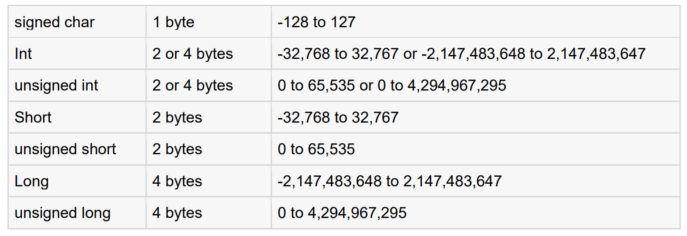
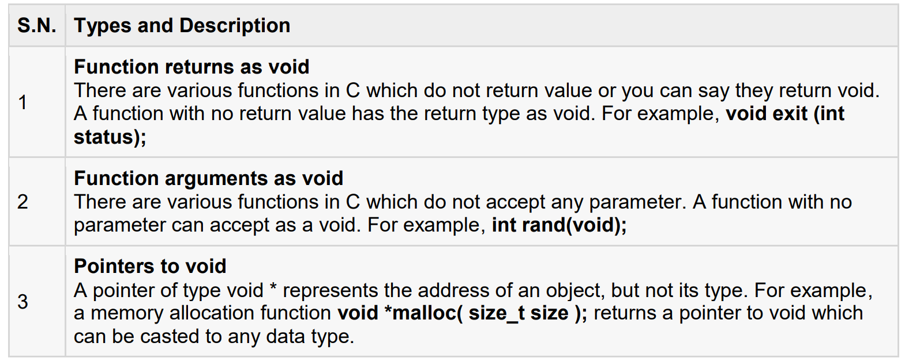
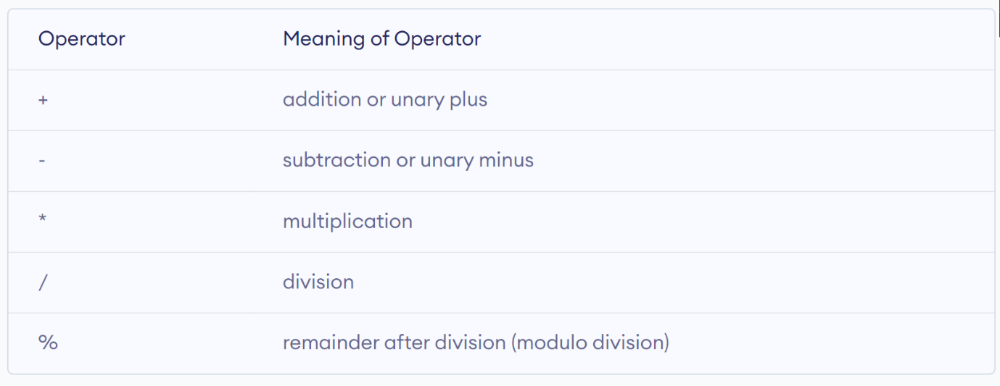

# Software Development 2 Lab 01 -- Getting Started with C

<script src="https://cdn.jsdelivr.net/npm/code-line"></script>
<script>CodeLine.initOnPageLoad({toggleBtn: {show: false}, copyBtn: {show: false}})</script>

<link rel="stylesheet" href="/module-content/css/block.css">

These tutorials are designed to teach you a number of C Programming principles with sophisticated topics and examples. The goal of each problem is not to solve that specific problem, but to exercise a certain set of skills, or to practice solving a certain type of problem. 

C programming language is a general purpose, high level language that was originally developed by Dennis MacAlistair Ritchie in Bell Labs. In essence, Dennis MacAlistair Ritchie was an American computer scientist. Nowadays, the C language is widely used in application, operating system, and embedded system development, and its influence is seen in most modern programming languages. 

Most importantly, during the 1980s, C gradually gained popularity. It has become one of the most widely used programming languages with C compilers from various vendors available for the majority of existing computer architectures and operating systems. C has been standardized by the American National Standards Institute (ANSI) since 1989 (ANSI C) and by the International Organization for Standardization (ISO). As of September 2020, C is the most popular programming language. Why? Many of the C projects that exist today were started decades ago:

- The UNIX operating system’s development started in 1969, and its code was rewritten in C in 1972. The C language was actually created to move the UNIX kernel code from assembly to a higher-level language, which would do the same tasks with fewer lines of code.

- Oracle database development started in 1977, and its code was rewritten from assembly to C in 1983. It became one of the most popular databases in the world.

- In 1985 Windows 1.0 was released. Although Windows source code is not publicly available, it’s been stated that its kernel is mostly written in C, with some parts in assembly. Linux kernel development started in 1991, and it is also written in C.

There are many ways you can develop in C and C++. Today there are three main compilers:

- GNU Compiler Collection – `gcc`
- `clang`
- Microsoft C/C++ Compiler – `cl`

We are going to focus on using Microsoft’s compiler although you can use any compiler. The C and C++ we use is a standard. How you compile programs will be different.

If your machine is not setup with Visual Studio Code and a C/C++ compiler, use either of the following instructions. You only need go as far running the first built program:

- [Microsoft C/C++](https://code.visualstudio.com/docs/cpp/config-msvc)
- [Linux](https://code.visualstudio.com/docs/cpp/config-linux)
- [MacOS](https://code.visualstudio.com/docs/cpp/config-clang-mac)

From now on, we will provide instructions only for Microsoft C/C++ on Windows 10. Once you are setup, perform the following steps:

1. Open the Developer Command Prompt for VS.

2. In the command prompt, change to your user folder; e.g., cd C:\Users\student\.

3. Now create a new folder where you will undertake your work; e.g., mkdir sd2.

4. Change into your new folder, e.g., cd sd2.

5. Now start Visual Studio Code from this folder by typing code ..

**You will always have to start Visual Studio Code in this manner, so it sees the Microsoft C/C++ tools. This is just how Microsoft have set this up.**

We are now ready to learn some C. 

In this instance, now we are going to learn and apply C language. Throughout the below exercises we will examine a number of different programming exercises to perform a variety of tasks.

C program begins inside a function called `main`. A function is simply a collection of commands that do *something*. The `main` function is always called when the program first executes. From main, we can call other functions, whether they be written by us or by others or use built-in language features. To access the standard functions that comes with your compiler, you need to include a header with the `#include` directive. What this does is effectively take everything in the header and paste it into your program. Let’s look at a working program below:

```c
#include <stdio.h>

int main(int argc, char **argv)
{
	printf("I am alive! Beware.\n");
	return 0;
}
```

The `#include` is a **preprocessor** directive that tells the compiler to put code from the header called `stdio.h` into our program before actually creating the executable. By including header files, you can gain access to many different functions both the printf and getchar functions are included in `stdio.h`.

The next important line is `int main(int arc, char **argv)`. This is the start of our main application. The C compiler expects the main part to have the name main. We also define two incoming parameters – `argc` and `argv` which are the command line parameters (`argc` is the number, and `argv` the actual parameters). The line tells the compiler that there is a function named `main`, and that the function returns an integer, hence `int`. The *curly braces* (`{` and `}`) signal the beginning and end of functions and other code blocks. 

The `printf` function is the standard C way of displaying output on the screen. The quotes tell the compiler that you want to output the literal string as-is (almost). The `\n` sequence is actually treated as a single character that stands for a newline. The actual effect of `\n` is to move the cursor on your screen to the next line. Notice the semicolon: it tells the compiler that you are at the end of a command, such as a function call. You will see that the semicolon is used to end many lines in C.

Finally, at the end of the program, we return a value from main to the operating system by using the return statement. This return value is important as it can be used to tell the operating system whether our program succeeded or not. A return value of `0` means success.

The final brace closes off the function. You should try compiling this program and running it.

**Now you need to do by yourself – write your first C program and print your name, your address and your home city.** 

**If you use the `printf` function without writing `#include <stdio.h>` What will happen ?** 

## C Data Types

In C programming, data types are declarations for variables. This determines the type and size of data associated with variables. In this lesson, you will learn about basic data types such as int, float, char etc. in C programming. The types in C can be classified as follows:



### Integer Types

Following table gives you details about standard integer types with its storage sizes and value ranges:


****

To get the exact size of a type or a variable on a particular platform, you can use the sizeof operator. The expressions `sizeof(type)` yields the storage size of the object or type in bytes. Following is an example to get the size of int type on any machine:

```c
#include <stdio.h>
#include <limits.h>

int main(int argc, char **argv)
{
	printf("Storage size for int : %d \n", sizeof(int));
	return 0;
}
```

**When you compile and execute the above program, what this program will produce the result?**

### Floating-Point Types

Following table gives you details about standard floating-point types with storage sizes and value ranges and their precision:     ****

The header file `float.h` defines macros that allow you to use these values and other details about the binary representation of real numbers in your programs. Following example will print storage space taken by a `float` type and its range values:

```c
#include <stdio.h>
#include <float.h>

int main(int argc, char **argv)
{
  printf("Storage size for float : %d\n", sizeof(float));
	printf("Minimum float positive value: %E\n", FLT_MIN);
	printf("Maximum float positive value: %E\n", FLT_MAX);
	printf("Precision value: %d\n", FLT_DIG);
	return 0;
} 
```

**When you compile and execute the above program, what this program will produce the result?**

### `sizeof()` Function in C Language

Finally, we will run this below code and learn more about data types 

 ```c
#include <stdio.h>
#include <limits.h>

int main(int argc, char **argv)
{
	int a; 
  char b; 
  float c; 
  double d;
	printf("Storage size for int data type: %d\n", sizeof(a));
	printf("Storage size for char data type: %d\n", sizeof(b));
	printf("Storage size for float data type: %d\n", sizeof(c));
	printf("Storage size for double data type: %d\n", sizeof(d));
	return 0;
}
 ```

**When you compile and execute the above program, what this program will produce the result?**

We can use the `sizeof()` operator to check the size of a variable. See the following C program for the usage of the various data types:

```c
#include <stdio.h>

int main(int argc, char **argv)
{
	int a = 1;
  char b = 'G';
  double c = 3.14;

  printf(“Hello World ! \n”);**
	// printing the variables defined above along with their sizes
	printf("Hello! I am a character. My value is %c and my size is %lu bytes.\n", b, sizeof(char));
	// can use sizeof(b) above as well
	printf("Hello! I am an integer. My value is %d and my size is %lu bytes.\n", a, sizeof(int));
	// can use sizeof(a) above as well
	printf("Hello! I am a double floating point variable. My value is %lf and my size is %lu bytes.\n", c, sizeof(double));
	// can use sizeof(c) above as well
	printf("Bye! See you soon. :)\n");
	return 0;
}
```

**When you compile and execute the above program, what this program will produce the result?**

### The `void` Type

The `void` type specifies that no value is available. It is used in three kinds of situations:



The `void` type may not be understood to you at this point, so let us proceed and we will cover these concepts in the upcoming lessons. 

## C Variables

Variable is nothing but a name given to a storage area that our programs can manipulate. Each variable in C has a specific type, which determines the size and layout of the variable's memory; the range of values that can be stored within that memory; and the set of operations that can be applied to the variable. The name of a variable can be composed of letters, digits, and the underscore character. It must begin with either a letter or an underscore. Upper and lowercase letters are distinct because C is case-sensitive. Based on the basic types explained previously, there will be the following basic variable types:


C programming language also allows to define various other types of variables, which we will cover in subsequent chapters like Enumeration, Pointer, Array, Structure, Union, etc. For this lesson, let us study only basic variable types.

## Variable Definition in C

```c
#include <stdio.h>

int main(int argc, char **argv)
{
	/* c program to print value of a variable */ 
  int age = 33;
	printf("I am %d years old.\n", age);
}
```

**When you compile and execute the above program, what this program will produce the result?**

Try the following example, where variables have been declared at the top, but they have been defined and initialised inside the main function.

```c
#include <stdio.h>

// Variable declaration:
/* Extern is a keyword in C programming language which is used to declare a global variable that is a variable without any memory assigned to it. It is used to declare variables and functions in header files. Extern can be used access variables across C files */

extern int a, b;
extern int c;
extern float f;

int main (int argc, char **argv)
{
	/* variable definition: */
	int a, b;
	int c;
	float f;
	/* actual initialization */
	a = 10;
	b = 20;
	c = a + b;
	printf("value of c: %d\n", c);
	f = 70.0/3.0;
	printf("value of f: %f\n", f);
	return 0;
}
```

**When you compile and execute the above program, what this program will produce the result?** 

## C Arithmetic Operators

An arithmetic operator performs mathematical operations such as addition, subtraction, multiplication, division etc on numerical values (constants and variables).

****

```c
#include <stdio.h>

int main(int argc, char **argv)
{
	int a = 9, b = 4, c;
	c = a+b;
	printf("a+b = %d\n", c);
	c = a-b;
	printf("a-b = %d\n", c);
	c = a*b;
	printf("a*b = %d\n", c);
	c = a/b;
	printf("a/b = %d\n", c);
	c = a%b;
	printf("Remainder when a divided by b = %d\n", c);
	return 0;
}
```

**When you compile and execute the above program, what this program will produce the result?**

**Using arithmetic operators write a program in C to add the digits of a number taken from the user.**

 ```c
#include <stdio.h>

int main(int argc, char **argv)
{
	int x,y,a1,a2,a3,a4,z,sum;
	printf("Enter the number");
	scanf("%d", &x);
	y=x%10;
	a1=y;
  y=x/10;
	a2=y%10;
	a3=((y/10)%10);
	z=y/10;
	a4=z/10;
	sum=a1+a2+a3+a4;
	printf("sum=%d",sum);
	return 0;
}
 ```

**When you compile and execute the above program, what this program will produce the result?**