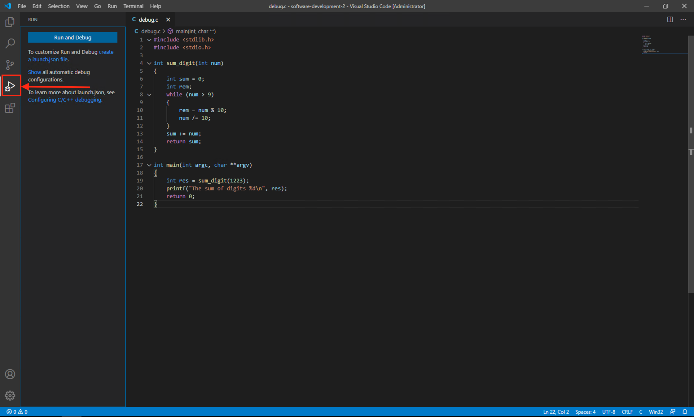
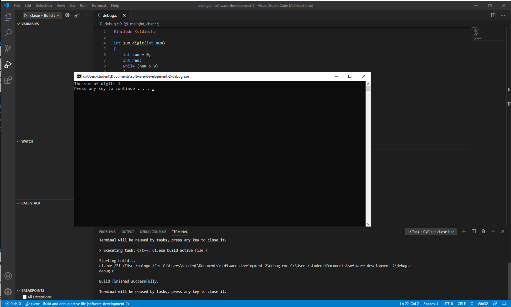
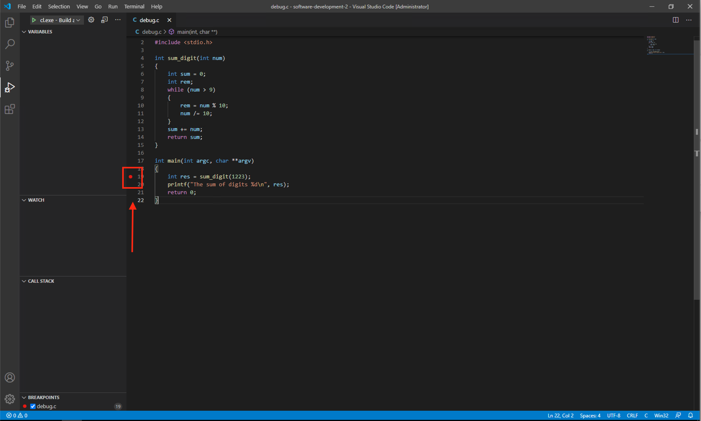
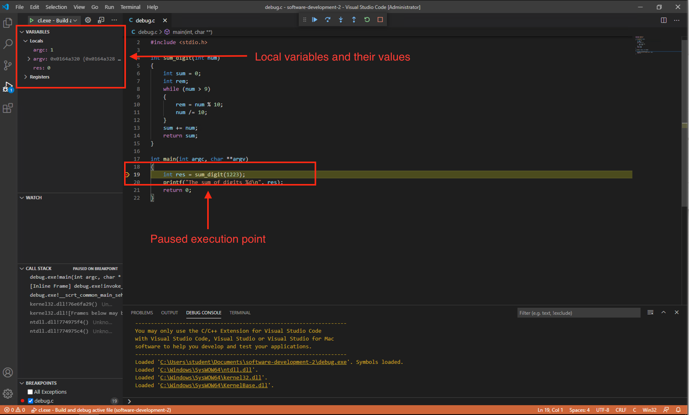
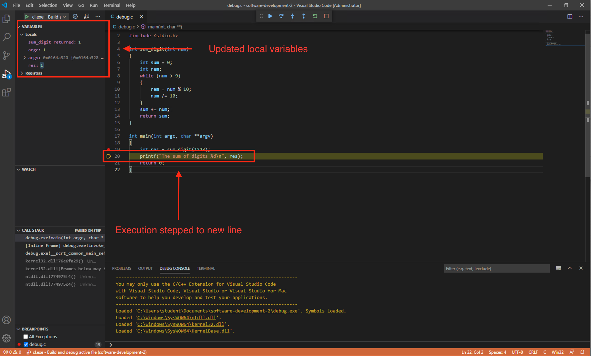

# Software Development 2 Lab 04 -- Program Tracing and Debugging

<script src="https://cdn.jsdelivr.net/npm/code-line"></script>
<script>CodeLine.initOnPageLoad({toggleBtn: {show: false}, copyBtn: {show: false}})</script>

<link rel="stylesheet" href="/module-content/css/block.css">

So far, we have been writing code and trying to fix errors as we go, hoping that the compiler will detect any problems we have. But what if our logic is incorrect? How do we find and resolve errors? You will find that this takes a significant amount of the work you will do as a programmer -- finding bugs and fixing them. Let us look at how we can do this.

## Printing Trace Messages

One simple method we have to debug a program is to print a trace (messages on what is happening) and analyse the problem. Let us start with an example program to help you understand the idea.

```c
#include <stdlib.h>
#include <stdio.h>

int my_function(int x, int y)
{
    printf("my_function entered. x = %d, y = %d\n", x, y);
    int temp = x / y;
    printf("my_function exiting. Returning %d\n", temp);
    return temp;
}

int main(int argc, char **argv) 
{
    int x = 5;
    int y = 10;
    printf("Calling my_function with %d, %d\n", x, y);
    int result = my_function(x, y);
    printf("my_function returned %d\n", result);
    x = 20;
    y = 2;
    printf("Calling my_function with %d, %d\n", x, y);
    result = my_function(x, y);
    printf("my_function returned %d\n", result);
    x = 100;
    y = 0;
    printf("Calling my_function with %d, %d\n", x, y);
    result = my_function(x, y);
    printf("my_function returned %d\n", result);
    return 0;
}
```

**Create this program -- `trace.c` -- then compile and run it. What is the error?**

As we are printing out trace messages, we are able to find the bug by examining the inputs and outputs of functions. We can discover quite quickly where our error is.

Program tracing comes in two forms:

- Tracing by adding code to print information.
- Tracing by hand by reading code.

**You need to start developing both skills.** Adding print statements to your code will help you find errors in your code when you aren't sure where your bug is. It allows you to check how far your program progresses before it crashes.

Tracing by hand will help you quickly work out what a bug is if you know where it is. When you are in class and ask for help, most of the time the lecturer will hand trace the algorithm first to understand what the issue might be.

## Debugging

Writing lots of tracing code might seem like a solution to debugging, but it does mean you spend lots of time writing new code that doesn't add to your program. Thankfully, programmers have better tools to help debug their programs. Typically, these are embedded in your development environment. We will work through how to do this in Visual Studio Code.

### Running Code in Visual Studio Code

Walk through starting Visual Studio Code in the right folder.

Let us now walk through how we can run code directly in Visual Studio Code. 

**For Windows users.** First, **Open the Developer Command Prompt for Visual Studio.** Now, you need to navigate to where we will create our code. For example, let us say your username is `studnet` and you want to create code in a folder called `software-development-2` in your Documents folder. Then you would use the following command:

```shell
cd C:\Users\student\Documents\software-development-2
code .
```

This will launch Visual Studio Code in that folder with the development tools accessible.

**Everyone (including Windows users) -- enter the following code into a file called `debug.c`.**

```c
#include <stdlib.h>
#include <stdio.h>

int sum_digit(int num)
{
    int sum = 0;
    int rem;
    while (num > 9)
    {
        rem = num % 10;
        num /= 10;
    }
    sum += num;
    return sum;
}

int main(int argc, char **argv)
{
    int res = sum_digit(1223);
    printf("The sum of digits %d\n", res);
    return 0;
}
```

This function `sum_digit` should sum all the digits that make up a number. For example:

- `sum_digit(5)` = 5
- `sum_digit(10)` = 1
- `sum_digit(13)` = 4
- `sum_digit(1223)` = 8

Let us run this program in Visual Studio Code and see the output. We are going to do things a bit differently though.

**In Visual Studio Code, open the Run Panel by selecting the Run button on the left-hand side. The image below illustrates.**



**Now press the Run and Debug blue button. This will open two options at the top of the screen as indicated in the image below.**


**Windows users -- select C++ (Windows). Linux/MacOS users -- select C++ (GDB/LLDB).** You will now be presented with new options at the top of the screen. Below is the option for Windows users.


**Windows users** -- select `cl.exe` as your configuration option.

**MacOS users** -- select `clang` as your configuration option.

**Linux users** -- select `gcc` as your configuration option.

Your application will build and run, and the output will be displayed in a debug console window. For example, in Windows you will see the following.



**Close any opened console windows. You will also see a `launch.json` file has been created and opened in Visual Studio Code. Also close this file.**

The Run Panel has changed, and we will talk through the different parts as we carry on debugging our program. **Note the button on the top-left of the screen**:


This will allow you to build and run the application at any time again. **This only works in any folder that you have already configured the build system using the steps we undertook above. Doing this will make your life easier in future.**

Note the output from our application:

```shell
The sum of digits 1
```

This is not the correct answer for our `sum_digit(1223)` which should be 8. Let us try and work out what the problem is.

### Breakpoints

We need to determine where the problem is. At the moment, we don't know anything about where our problem is. So let us just step through the code one step at a time.

Debugging works by setting breakpoints -- lines of code that we want the computer to stop executing our code at and pause waiting for us to say when to continue on.

**To set a breakpoint we left-click just to the left of a line in Visual Studio Code. Do this now for line 19 (the first line of main).** A red dot will appear next to this line as shown below.



Now let us run our application again. **Click the small green triangle in the top-left corner.** The image below illustrates the area. **Make sure just to click the green triangle.** Your application will start to run again.


Your Visual Studio Code window will change to the one below. We've highlighted two points of interest.



On the top-left you will see the local variables and their current values. In `main`, only three variables are used -- `arc` and `argv` (the parameters passed into `main`), and `res` where we store the result of `sum_digit()`.

We've also highlighted the current line where the execution is paused. This is currently the line which we put a breakpoint on.

At the top of the window, the following buttons will have appeared.


These buttons are (from left-to-right):

- **Continue** -- will continue executing the program as normal.
- **Step over** -- will step over the line of code currently paused on, executing it on the way. Basically, it executes the current line of code.
- **Step into** -- if the current line of code calls a function, pressing this button will cause the computer to enter this function. So, this will not execute the line of code if a function is present, but jump into the function.
- **Step out** -- if the current line of code is within a function, pressing this button will complete the function and return to the calling line of code.
- **Restart** -- will restart the program execution.
- **Stop** -- stops the program execution.

Let us now execute the current line of code. **Press the step over button. It is the one illustrated below.**


Notice your Visual Studio Code screen has updated as below:



- Execution has moved onto the next line of code. We have completed the call to `sum_digit`.
- The variables have been updated. **Note that `res` is 1. We know this is wrong. `res` should be 8 after we call `sum_digit`**.
  - Also not that we can see `sum_digit

So we now know the problem is within `sum_digit`. **Restart the execution by pressing the restart button, which is illustrated below.**


This time, we will step into the `sum_digit` function. **Press the step into button now. It is illustrated below.**


Your screen will be updated to the following. There are three points of interest:


- The variables section in the top-left has been updated to the local variables in the `sum_digit` function. There are three values:
  - `num` -- the parameter passed into `sum_digit`. This is 1223 at the start.
  - `sum` -- where we are storing the result to return from `sum_digit`. This is set to 0 at the start of `sum_digit`.
  - `rem` -- used in the calculation in `sum_digit`. We don't set a value for this at the start, so it is just whatever is in memory. In the example above this is 3632887.
- The execution is now paused on line 5 which is the start of `sum_digit`.
- The **call stack** is updated. The call stack is the list of function calls that has led to where we are right now in the program execution. The top item is the current function. Currently there are eight functions called, but most of these are from the operating system. **This will be different depending on the system you are running your program from.** Starting from the bottom:
  - `ntdll.dll` is part of the Windows 10 operating system. It contains many functions, and we don't know which one specifically was called.
  - A second `ntdll.dll`.
  - `kernel32.dll` is also part of the Windows 10 operating system. This is the 32-bit kernel mode in the operating system. There are also many functions in this library.
  - A second `kernel32.dll`.
  - `debug.exe` is the debugger that is running our code for us. The first line is the start of the debugger program.
  - Another `debug.exe` function call.
  - Finally, we get to our own code. `debug.exe!main` is the debugger executing our `main` function.
  - `debug.exe!sum_digit` is the current function being executed -- `sum_digit`.

So we now know that our function seems to be starting correctly. 1223 is being passed in as a parameter. Let us finish the function. **Click the Step Out button now. It is illustrated below.**


Your application will now return to the main function. **Next press the Continue (below) button to run the application to completion. Close any terminal windows that have opened.**


**Start the application again by clicking on the Green Triangle at the top-left of the Visual Studio window.**


Your application will pause at the breakpoint. **Now do the following actions to get to the start of the `while` loop:**

- **Step Into**.
- **Step Over twice.**

Your Visual Studio Code window should look like the following, with execution paused at the start of the `while` loop.


Let us now step through one iteration of the loop and see what happens. **Step Over three times to pause your code at the end of the loop as illustrated below.**


**Now look at your variables.** They should be:

- `num` 122
- `rem` 3
- `sum` 0

OK, `sum` didn't change. That is our bug. We've been stupid and forgotten to update `sum` during the `while` loop. Let us fix that now. **Press the Stop button to stop running the program. It is illustrated below.**


**Fix the `while` loop by adding the line `sum += rem;`. See below for where to add it.**


**Now restart the program and step through again until the end of the first iteration of the `while` loop. See below as an example of the Visual Studio Code window.** Notice now that `sum` is updating. **Use Continue to run the application to completion and check the output is correct.**


**Left-click on the breakpoint to remove it and test the application with different numbers for `sum_digit` to check it is working.**

### General Debugging Workflow

Our general debugging workflow is as follows:

1. Run application and find there is an error.
2. Set a breakpoint as close to where you know the error is. If you don't know, use the start of the application.
3. Step through the program trying to find where the error is occurring. Use Step Over initially until you find which function the error is occurring.
4. Set new breakpoints closer to where the problem seems to be.
5. Repeat steps 3 and 4 until you find where the bug is.

### Exercise

Find where the bug is in the following application. It generates the factorial of an input from the user. For example:

- Factorial(1) = 1
- Factorial(2) = 2 * 1 = 2
- Factorial(3) = 3 * 2 * 1 = 6
- Factorial(4) = 4 * 3 * 2 * 1 = 24

```c
#include <stdlib.h>
#include <stdio.h>

int main(int argc, char **argv)
{
    int num;
    int total;
    printf("Enter the number: ");
    scanf("%d", &num);
    for (int i = 1; i < num; ++i)
    {
        total = total * i;
    }
    printf("The factorial of %d is %d\n", num, total);
    return 0;
}
```

## Advice

Programming is a bit of a lifestyle choice. To be a good programmer, you need to put a lot of hours of practice in. That means working through tutorials, fixing your errors, and training yourself in the skill of programming. Debugging really helps here. You should be spending 10-20 hours outside class practicing programming. It is a key skill in computer science, and you will find we will be moving much faster in what we expect you to achieve from now on.